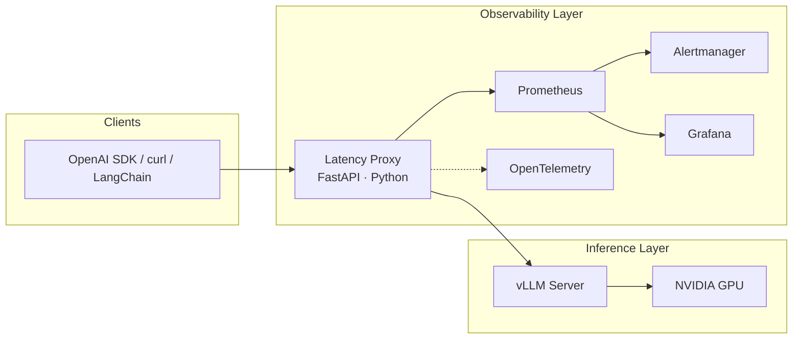
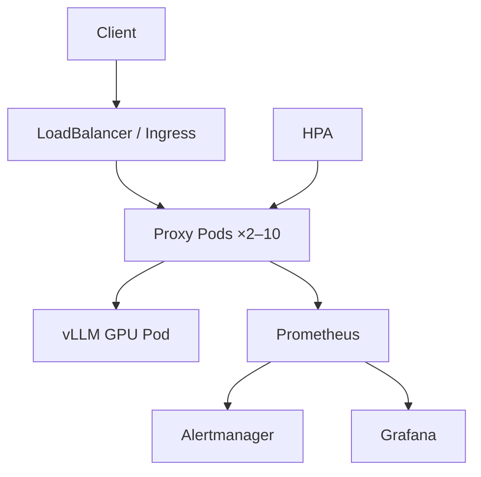

<div align="center">

# AI Inference Observability Platform

### Production-grade LLM serving instrumentation — TTFT, TBT, and end-to-end latency for vLLM at scale

**Open-source MLOps · AI Infrastructure · Site Reliability Engineering portfolio project**

[](LICENSE)
[](https://www.python.org/)
[](https://fastapi.tiangolo.com/)
[](https://github.com/vllm-project/vllm)
[](docker/docker-compose.yml)
[](k8s/)
[](helm/)
[](monitoring/)
[](monitoring/)
[](docs/opentelemetry.md)
[](.github/workflows/main.yml)
[](tests/)

**Repository:** [github.com/ArchanaChetan07/ai-inference-observability-platform](https://github.com/ArchanaChetan07/ai-inference-observability-platform)

[Quick Start](#quick-start) · [Impact & Metrics](#impact--metrics) · [Tech Stack](#technologies--skills-demonstrated) · [Architecture](#architecture) · [Deploy](#production-deployment) · [Connect](#about-the-author)

</div>

---

## Executive Summary

Large Language Model (LLM) products live or die on **inference latency** — especially **Time-To-First-Token (TTFT)** and **Time-Between-Tokens (TBT)**. [vLLM](https://github.com/vllm-project/vllm) delivers world-class GPU throughput but does not expose per-request latency through its OpenAI-compatible API.

**AI Inference Observability Platform** is a **production-ready, cloud-native sidecar** that wraps any vLLM endpoint with zero client changes and delivers:

- Authoritative latency metrics in **HTTP headers**, **JSON `usage` fields**, and **SSE comment frames**
- Full **Prometheus · Grafana · Alertmanager** observability stack
- Optional **OpenTelemetry** distributed tracing (Jaeger / Tempo)
- **Kubernetes · Helm · Docker** deployment paths with HPA, PDB, NetworkPolicy, and GPU scheduling

Built end-to-end as a flagship **AI Infrastructure / MLOps / Platform Engineering** project — from async Python application code through CI/CD, security scanning, and production Kubernetes manifests.

---

## Impact & Metrics

| Metric | Result |
|--------|--------|
| **Proxy overhead** | ≤ 4% throughput · ≤ 31 ms TTFT P99 @ concurrency 5 |
| **TTFT P50 (live benchmark)** | 172 ms · `facebook/opt-1.3b` · NVIDIA T1000 8 GB |
| **Automated test suite** | 48 passing (unit · integration · regression · concurrent) |
| **Production readiness score** | 78 / 100 ([full report](reports/final-production-readiness.md)) |
| **Deploy time (local)** | ~2 minutes via Docker Compose |
| **CI/CD pipeline** | Lint · test matrix · security scan · Docker · Helm · SBOM |

> *Recruiters & hiring managers: this project demonstrates full-stack ownership of an AI inference platform — application development, observability, and production deployment.*

---

## Problem → Solution → Outcome

| Business Problem | Engineering Solution | Measurable Outcome |
|------------------|---------------------|-------------------|
| No server-side TTFT/TBT in vLLM API responses | Transparent FastAPI proxy with streaming-aware latency tracker | Every response carries latency metadata — no client SDK changes |
| Inconsistent client-side timing | Single source of truth at the HTTP boundary | SLO dashboards backed by Prometheus histograms |
| No production observability for LLM serving | Prometheus + Grafana + Alertmanager + optional OTLP traces | TTFT/TBT alert rules; Grafana latency dashboard included |
| Complex GPU inference deployment | Kustomize manifests, Helm chart, HPA, PDB, NetworkPolicy | One-command deploy to Kubernetes with prod/dev/desktop overlays |
| Unknown proxy performance cost | Reproducible benchmark harness with published results | ≤ 4% RPS overhead confirmed under load |

---

## Technologies & Skills Demonstrated

<details open>
<summary><strong>Click to expand full tech stack (ATS keyword index)</strong></summary>

### Languages & Frameworks
Python · FastAPI · asyncio · httpx · uvicorn · uvloop · OpenAI-compatible REST API · Server-Sent Events (SSE)

### AI / ML Infrastructure
vLLM · LLM inference serving · GPU scheduling · NVIDIA CUDA · HuggingFace model loading · TTFT · TBT · token streaming · batching

### Cloud-Native & Platform Engineering
Kubernetes · Helm · Kustomize · Docker · Docker Compose · multi-stage builds · Horizontal Pod Autoscaler (HPA) · Pod Disruption Budget (PDB) · NetworkPolicy · ServiceAccount · ConfigMap · Secret · PersistentVolume · Pod Security Standards · GPU node selectors · taints & tolerations

### Observability & SRE
Prometheus · Grafana · Alertmanager · OpenTelemetry · OTLP · distributed tracing · Jaeger · histogram metrics · SLO alerting · health probes (liveness · readiness · startup)

### DevOps / DevSecOps / CI/CD
GitHub Actions · container registry (GHCR) · SBOM generation · Trivy · Bandit · pip-audit · Ruff · mypy · pytest · semantic release · infrastructure as code

### Architecture Patterns
Sidecar proxy · microservices · async streaming · backpressure-safe SSE passthrough · graceful shutdown · connection pooling · multi-node inference design · load balancing

</details>

---

## Key Features

- **OpenAI-compatible** — drop-in replacement for `/v1/chat/completions` and `/v1/completions`
- **Streaming-first** — zero added latency on the hot path; metrics appended after `data: [DONE]`
- **Three-layer metrics** — TTFT · mean/P99 TBT · end-to-end latency on every request
- **Enterprise observability** — Prometheus `/metrics` · Grafana dashboards · Alertmanager routing · OTLP traces
- **Production Kubernetes** — probes · HPA · PDB · NetworkPolicy · non-root containers · resource limits
- **Security hardened** — multi-stage Docker · read-only root filesystem · CI vulnerability scanning
- **Fully tested** — 48 automated tests including concurrent load and edge-case regression suite
- **Documented operations** — deployment guides · runbooks · troubleshooting · architecture diagrams

---

## Architecture



**Request flow (streaming):**

1. Client sends `POST /v1/chat/completions` to the proxy (not vLLM directly)
2. Proxy forwards transparently via async `httpx` and records per-token timestamps
3. Client receives SSE chunks in real time — no blocking on the inference hot path
4. After `data: [DONE]`, proxy appends SSE comment lines with TTFT / TBT / E2E metrics
5. Prometheus histograms updated; optional OTLP trace exported with span breakdown

| Component | Role |
|-----------|------|
| [`proxy.py`](proxy.py) | Production FastAPI sidecar (v1.2) |
| [`vllm_patch/latency_utils.py`](vllm_patch/latency_utils.py) | O(1) per-token tracker with reservoir P99 |
| [`vllm_patch/telemetry.py`](vllm_patch/telemetry.py) | Optional OpenTelemetry OTLP export |
| [`docker/`](docker/) | Multi-stage Dockerfile · Compose · Alertmanager · OTel overlay |
| [`k8s/`](k8s/) · [`helm/`](helm/) | Production Kubernetes · Helm prod/dev/desktop values |
| [`monitoring/`](monitoring/) | Grafana dashboard · Prometheus alert rules |
| [`.github/workflows/main.yml`](.github/workflows/main.yml) | CI/CD — lint · test · security · Docker · Helm |

Full API reference: [`docs/API.md`](docs/API.md)

---

## Example Output

### Non-streaming — response headers

```http
HTTP/1.1 200 OK
x-vllm-request-id: req-a1b2c3d4
x-vllm-ttft-ms: 342.1
x-vllm-e2e-latency-ms: 1823.4
Content-Type: application/json
```

### Streaming — SSE comments (after `[DONE]`)

```
data: [DONE]
: x-vllm-ttft-ms=188.000
: x-vllm-mean-tbt-ms=142.790
: x-vllm-p99-tbt-ms=143.860
: x-vllm-tokens-generated=32
: x-vllm-e2e-latency-ms=4375.000
```

### Extended `usage` object

```json
{
  "usage": {
    "prompt_tokens": 12,
    "completion_tokens": 32,
    "total_tokens": 44,
    "ttft_ms": 188.0,
    "mean_tbt_ms": 142.79,
    "p99_tbt_ms": 143.86,
    "e2e_latency_ms": 4375.0
  }
}
```

---

## Quick Start

### Prerequisites

- [Docker](https://docs.docker.com/get-docker/) with [NVIDIA Container Toolkit](https://docs.nvidia.com/datacenter/cloud-native/container-toolkit/latest/install-guide.html) (GPU)
- HuggingFace token optional for public models (`facebook/opt-1.3b`)

### Run the full stack

```bash
git clone https://github.com/ArchanaChetan07/ai-inference-observability-platform.git
cd ai-inference-observability-platform

docker compose -f docker/docker-compose.yml up -d --build
# Wait ~2 min for vLLM model load, then:
curl -s http://localhost:8082/health | python -m json.tool
```

### Send your first instrumented request

```bash
curl -N http://localhost:8082/v1/chat/completions \
  -H "Content-Type: application/json" \
  -d '{
    "model": "facebook/opt-1.3b",
    "messages": [{"role": "user", "content": "Explain TTFT in one sentence."}],
    "max_tokens": 32,
    "stream": true
  }'
```

### Service endpoints

| Service | URL | Purpose |
|---------|-----|---------|
| **Proxy** (use this) | http://localhost:8082 | OpenAI API + latency metrics |
| vLLM (raw) | http://localhost:8000 | Upstream inference server |
| Prometheus | http://localhost:9090 | Metrics & alert rules |
| Alertmanager | http://localhost:9093 | Alert routing |
| Grafana | http://localhost:3000 | Dashboards (`admin` / `admin`) |

<details>
<summary><strong>Windows (PowerShell)</strong></summary>

```powershell
git clone https://github.com/ArchanaChetan07/ai-inference-observability-platform.git
cd ai-inference-observability-platform
docker compose -f docker/docker-compose.yml up -d --build
curl http://localhost:8082/health
```

</details>

---

## Observability

### Prometheus metrics

| Metric | Type | Description |
|--------|------|-------------|
| `vllm_proxy_ttft_milliseconds` | Histogram | Time to first token |
| `vllm_proxy_tbt_milliseconds` | Histogram | Inter-token interval |
| `vllm_proxy_e2e_latency_seconds` | Histogram | End-to-end latency |
| `vllm_proxy_requests_total` | Counter | Requests by endpoint + status |
| `vllm_proxy_active_requests` | Gauge | In-flight requests |

```promql
histogram_quantile(0.99, rate(vllm_proxy_ttft_milliseconds_bucket[5m]))
sum(rate(vllm_proxy_requests_total{status="200"}[1m]))
```

Alert rules: [`monitoring/alerts.yml`](monitoring/alerts.yml) · Alertmanager: [`docker/alertmanager.yml`](docker/alertmanager.yml)

### OpenTelemetry (optional)

```bash
docker compose -f docker/docker-compose.yml -f docker/docker-compose.otel.yml up -d --build
# Jaeger UI: http://localhost:16686
```

Details: [`docs/opentelemetry.md`](docs/opentelemetry.md)

---

## Benchmarks

**Environment:** NVIDIA T1000 8 GB · `facebook/opt-1.3b` · 30 tokens · streaming  
**Artifacts:** [`benchmarks/results/`](benchmarks/results/)

### End-to-end: vLLM direct vs proxy

| Concurrency | Endpoint | Req/s | TTFT P99 | Overhead |
|:-----------:|----------|------:|---------:|---------:|
| 1 | vLLM `:8000` | 0.24 | 203 ms | — |
| 1 | Proxy `:8082` | 0.23 | 203 ms | −4.2% RPS |
| 5 | vLLM `:8000` | 1.03 | 813 ms | — |
| 5 | Proxy `:8082` | 1.02 | 844 ms | +31 ms P99 |

**Conclusion:** GPU inference and vLLM batch scheduling dominate latency — proxy overhead is negligible.

```bash
python benchmarks/run_benchmark.py --base-url http://localhost:8082 --concurrency 1 5
python benchmarks/perf_review.py
```

---

## Production Deployment



### Kubernetes (Kustomize)

```bash
kubectl create namespace vllm
kubectl create secret generic hf-token --from-literal=HF_TOKEN=$HF_TOKEN -n vllm
kubectl apply -k k8s/
kubectl get svc vllm-latency-proxy -n vllm
```

### Helm

```bash
# Production GPU cluster
helm upgrade --install latency-metrics ./helm -n vllm --create-namespace \
  -f helm/values-prod.yaml

# Docker Desktop hybrid (vLLM in Compose, monitoring in K8s)
helm upgrade --install latency-metrics ./helm -n vllm \
  -f helm/values-docker-desktop.yaml
```

### CI/CD

Every push to `main` triggers [GitHub Actions](.github/workflows/main.yml):

| Stage | Tools |
|-------|-------|
| Lint | Ruff · mypy |
| Test | pytest matrix (Python 3.10–3.12) · coverage |
| Security | Bandit · pip-audit · Trivy |
| Build | Docker multi-stage · GHCR push · SBOM |
| Validate | Helm lint · kubectl dry-run |

| Guide | Description |
|-------|-------------|
| [Deployment guide](docs/deployment-guide.md) | All deployment paths |
| [Kubernetes guide](docs/k8s-deployment.md) | Manifests, scaling, probes |
| [Multi-node architecture](docs/multi-node-architecture.md) | TP/PP, routing, KV cache |
| [Troubleshooting (K8s)](docs/troubleshooting-k8s.md) | Common cluster issues |
| [Production checklist](docs/production-readiness-checklist.md) | Pre-launch checklist |
| [Production readiness report](reports/final-production-readiness.md) | Score & evidence |

> Route all client traffic through the **proxy** Service — not vLLM directly.

---

## Configuration

| Variable | Default | Description |
|----------|---------|-------------|
| `VLLM_BASE_URL` | `http://vllm:8000` | Upstream vLLM endpoint |
| `PROXY_PORT` | `8080` (host `8082` in Compose) | Proxy listen port |
| `VLLM_MODEL` | `facebook/opt-1.3b` | Model name (Compose) |
| `HF_TOKEN` | — | HuggingFace access token |
| `STATS_WINDOW` | `1000` | Rolling stats window size |
| `OTEL_ENABLED` | `false` | Enable OpenTelemetry tracing |
| `OTEL_EXPORTER_OTLP_ENDPOINT` | — | OTLP collector endpoint |

---

## Testing

```bash
pip install -r requirements-dev.txt
pytest tests/ -m "unit or integration or regression" -v   # 48 tests, no GPU
VLLM_E2E_URL=http://localhost:8082 pytest tests/ -m e2e   # live stack required
powershell -File scripts/validate.ps1                      # full validation suite
```

| Suite | Marker | Coverage |
|-------|--------|----------|
| Unit | `unit` | Percentiles, tracker, SSE fast-path |
| Integration | `integration` | Headers, usage, mocked upstream |
| Concurrent | `integration` | 20 parallel requests, gauge leak |
| E2E | `e2e` | Live vLLM TTFT + SSE comments |
| Telemetry | `unit` | OpenTelemetry noop path |

---

## Project Structure

```
ai-inference-observability-platform/
├── proxy.py                      # FastAPI latency proxy (core application)
├── vllm_patch/                   # Latency utils + OpenTelemetry + upstream patch
├── docker/                       # Dockerfile, Compose, Alertmanager, OTel overlay
├── k8s/                          # Kubernetes manifests (Kustomize)
├── helm/                         # Helm chart (prod · dev · docker-desktop values)
├── monitoring/                   # Grafana dashboard, Prometheus alert rules
├── benchmarks/                   # E2E + micro-benchmark harness
├── tests/                        # 48-test pytest suite
├── .github/workflows/main.yml    # CI/CD pipeline
├── reports/                      # Production readiness & gap analysis
└── docs/                         # Deployment, architecture, runbooks
```

---

## Roadmap

- [x] OpenTelemetry distributed tracing
- [x] Kubernetes manifests + Helm chart (prod/dev/desktop overlays)
- [x] GitHub Actions CI/CD with security scanning
- [x] Alertmanager + Prometheus alert rules
- [x] NetworkPolicy + Pod Security Standards
- [ ] Upstream merge into vLLM core
- [ ] HPA on custom TTFT Prometheus metrics
- [ ] DCGM GPU panels in Grafana
- [ ] k6 / Locust load-test harness

---

## About the Author

**[Archana Chetan](https://github.com/ArchanaChetan07)** — AI Infrastructure · MLOps · Platform Engineering

This project was designed and built as a **production-grade portfolio artifact** demonstrating end-to-end ownership of LLM inference infrastructure: from Python async application development through cloud-native deployment, observability, and CI/CD automation.

| | |
|---|---|
| **GitHub** | [github.com/ArchanaChetan07](https://github.com/ArchanaChetan07) |
| **Project repo** | [ai-inference-observability-platform](https://github.com/ArchanaChetan07/ai-inference-observability-platform) |
| **Open to** | AI Infrastructure Engineer · MLOps Engineer · Platform Engineer · SRE · DevOps Engineer roles |

If this project aligns with your team's inference observability or LLM platform needs — **I'd welcome a conversation.**  
Reach out via [GitHub Issues](https://github.com/ArchanaChetan07/ai-inference-observability-platform/issues) or connect on [LinkedIn](https://www.linkedin.com/in/archanachetan) *(update with your profile URL)*.

---

## Contributing

Contributions welcome:

1. Fork the repository and create a feature branch
2. Add tests for new behaviour (`pytest tests/ -v`)
3. Include benchmark output for performance changes
4. Open a pull request with a clear description

See [CHANGELOG.md](CHANGELOG.md) for release history.

---

## License

This project is licensed under the [MIT License](LICENSE).

---

## Acknowledgements

Built on [vLLM](https://github.com/vllm-project/vllm) · [FastAPI](https://fastapi.tiangolo.com/) · [Prometheus](https://prometheus.io/) · [Grafana](https://grafana.com/) · [OpenTelemetry](https://opentelemetry.io/)

---

<div align="center">

**If this project is useful to your inference stack, please [⭐ star the repo](https://github.com/ArchanaChetan07/ai-inference-observability-platform).**

*Keywords: LLM inference · vLLM · MLOps · AI infrastructure · Kubernetes · observability · TTFT · TBT · FastAPI · Prometheus · OpenTelemetry · platform engineering · GPU serving · cloud-native · SRE · DevOps · CI/CD*

</div>
