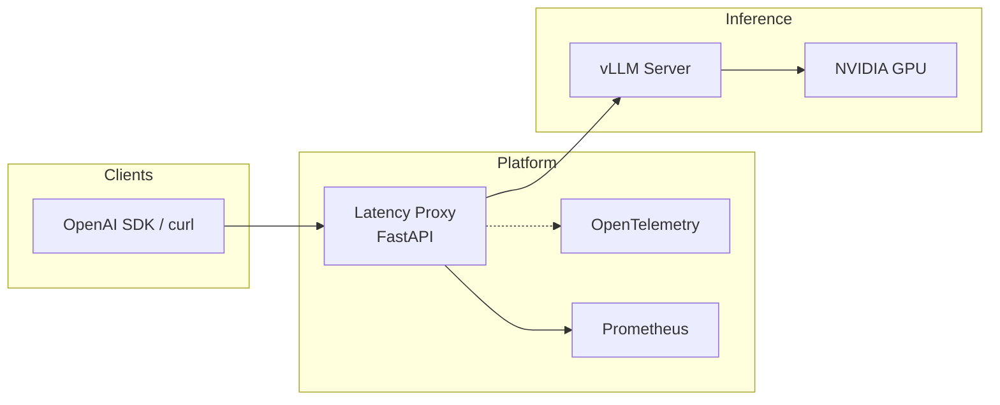
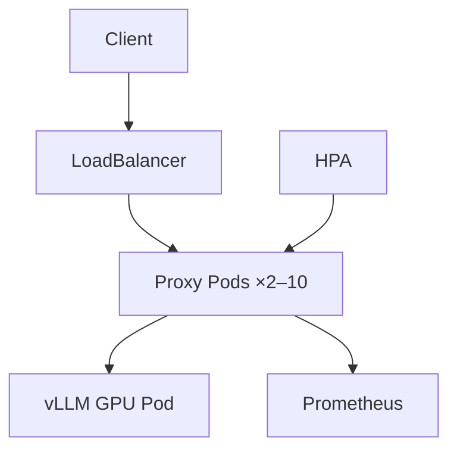

<div align="center">

# AI Inference Observability Platform

**Production-grade latency instrumentation for vLLM — TTFT, TBT, and end-to-end metrics in every API response.**

[](LICENSE)
[](https://www.python.org/)
[](https://fastapi.tiangolo.com/)
[](https://github.com/vllm-project/vllm)
[](docker/docker-compose.yml)
[](helm/)
[](docs/API.md)
[](docs/opentelemetry.md)

[Quick Start](#quick-start) · [Docs](docs/deployment-guide.md) · [Architecture](#architecture) · [Deployment](#production-deployment) · [Benchmarks](#benchmarks)

</div>

---

## Overview

Large language model serving is judged on **responsiveness** — how fast the first token arrives (TTFT) and how smoothly tokens stream (TBT). [vLLM](https://github.com/vllm-project/vllm) optimizes GPU throughput internally, but its OpenAI-compatible API does not expose per-request latency to clients.

**AI Inference Observability Platform** closes that gap with a transparent FastAPI proxy that wraps any vLLM endpoint and surfaces authoritative latency metrics — without modifying client code or forking vLLM.

| | |
|---|---|
| **Deploy time** | ~2 minutes (Docker Compose, includes model download) |
| **Proxy overhead** | ≤ 4% RPS · ≤ 31 ms TTFT P99 @ concurrency 5 |
| **Test coverage** | 53 automated tests (unit · integration · concurrent · E2E) |
| **Production stack** | Kubernetes · Helm · Prometheus · Grafana · OpenTelemetry |

---

## Why teams use this

| Challenge | How this platform solves it |
|-----------|----------------------------|
| No server-side TTFT/TBT in vLLM responses | Injects metrics into headers, `usage` fields, and SSE comments |
| Inconsistent client-side timing | Single source of truth at the HTTP boundary |
| No SLO dashboards out of the box | Prometheus histograms + Grafana dashboard + alert rules |
| Hard to debug latency spikes | Optional OpenTelemetry traces with per-request breakdown |
| Production deployment complexity | Modular K8s manifests, Helm chart, HPA, GPU scheduling |

---

## Key features

- **OpenAI-compatible** — `/v1/chat/completions` and `/v1/completions` with zero client changes
- **Streaming-first** — SSE passthrough; latency comments after `data: [DONE]` (never blocks the terminal chunk)
- **Three metric layers** — TTFT · mean/P99 TBT · end-to-end latency on every request
- **Full observability** — Prometheus `/metrics` · Grafana dashboards · OTLP traces (Jaeger / Tempo)
- **Production-ready** — Docker Compose · Kustomize · Helm · HPA · PDB · GPU node scheduling
- **Optional upstream patch** — Annotated vLLM engine integration for GPU-authoritative measurement ([`vllm_patch/`](vllm_patch/))
- **Benchmarked** — Reproducible E2E and micro-benchmark suite with published results

---

## Quick start

### Prerequisites

- [Docker](https://docs.docker.com/get-docker/) with [NVIDIA Container Toolkit](https://docs.nvidia.com/datacenter/cloud-native/container-toolkit/latest/install-guide.html) (GPU)
- HuggingFace token optional for public models (`facebook/opt-1.3b`)

### Run the full stack

```bash
git clone https://github.com/ArchanaChetan07/ai-inference-observability-platform.git
cd ai-inference-observability-platform

docker compose -f docker/docker-compose.yml up -d --build
# Wait ~2 min for vLLM to load weights, then:
curl -s http://localhost:8080/health | python -m json.tool
```

### Send your first instrumented request

```bash
curl -N http://localhost:8080/v1/chat/completions \
  -H "Content-Type: application/json" \
  -d '{
    "model": "facebook/opt-1.3b",
    "messages": [{"role": "user", "content": "Explain TTFT in one sentence."}],
    "max_tokens": 32,
    "stream": true
  }'
```

### Service endpoints

| Service | URL | Purpose |
|---------|-----|---------|
| **Proxy** (use this) | http://localhost:8080 | OpenAI API + latency metrics |
| vLLM (raw) | http://localhost:8000 | Upstream inference server |
| Prometheus | http://localhost:9090 | Metrics collection |
| Grafana | http://localhost:3000 | Dashboards (`admin` / `admin`) |

<details>
<summary><strong>Windows (PowerShell)</strong></summary>

```powershell
git clone https://github.com/ArchanaChetan07/ai-inference-observability-platform.git
cd ai-inference-observability-platform
$env:PROXY_PORT = "8081"   # if port 8080 is occupied
docker compose -f docker/docker-compose.yml up -d --build
curl http://localhost:8081/health
```

</details>

---

## Architecture



**Request flow (streaming):**

1. Client sends `POST /v1/chat/completions` to the proxy
2. Proxy forwards transparently to vLLM and tracks token arrival timestamps
3. Client receives SSE chunks in real time — no added latency on the hot path
4. After `data: [DONE]`, proxy appends SSE comment lines with TTFT/TBT/E2E
5. Prometheus histograms updated; optional OTLP trace exported

| Component | Role |
|-----------|------|
| [`proxy.py`](proxy.py) | Production FastAPI sidecar (v1.2) |
| [`vllm_patch/latency_utils.py`](vllm_patch/latency_utils.py) | O(1) per-token tracker with reservoir P99 |
| [`vllm_patch/telemetry.py`](vllm_patch/telemetry.py) | Optional OpenTelemetry OTLP export |
| [`docker/`](docker/) | Multi-stage Dockerfile · Compose stacks |
| [`k8s/`](k8s/) · [`helm/`](helm/) | Production Kubernetes deployment |
| [`monitoring/`](monitoring/) | Grafana dashboard · Prometheus alert rules |

Full API reference: [`docs/API.md`](docs/API.md)

---

## Example output

### Non-streaming — response headers

```http
HTTP/1.1 200 OK
x-vllm-request-id: req-a1b2c3d4
x-vllm-ttft-ms: 342.1
x-vllm-e2e-latency-ms: 1823.4
Content-Type: application/json
```

### Streaming — SSE comments (after `[DONE]`)

```
data: [DONE]
: x-vllm-ttft-ms=188.000
: x-vllm-mean-tbt-ms=142.790
: x-vllm-p99-tbt-ms=143.860
: x-vllm-tokens-generated=32
: x-vllm-e2e-latency-ms=4375.000
```

### Extended `usage` object

```json
{
  "usage": {
    "prompt_tokens": 12,
    "completion_tokens": 32,
    "total_tokens": 44,
    "ttft_ms": 188.0,
    "mean_tbt_ms": 142.79,
    "p99_tbt_ms": 143.86,
    "e2e_latency_ms": 4375.0
  }
}
```

---

## Observability

### Prometheus metrics

| Metric | Type | Description |
|--------|------|-------------|
| `vllm_proxy_ttft_milliseconds` | Histogram | Time to first token |
| `vllm_proxy_tbt_milliseconds` | Histogram | Inter-token interval |
| `vllm_proxy_e2e_latency_seconds` | Histogram | End-to-end latency |
| `vllm_proxy_requests_total` | Counter | Requests by endpoint + status |
| `vllm_proxy_active_requests` | Gauge | In-flight requests |

```promql
histogram_quantile(0.99, rate(vllm_proxy_ttft_milliseconds_bucket[5m]))
sum(rate(vllm_proxy_requests_total{status="200"}[1m]))
```

Alert rules: [`monitoring/alerts.yml`](monitoring/alerts.yml)

### OpenTelemetry (optional)

Enable distributed tracing with Jaeger or Grafana Tempo:

```bash
docker compose -f docker/docker-compose.yml -f docker/docker-compose.otel.yml up -d --build
# Jaeger UI: http://localhost:16686
```

| Span | What it captures |
|------|-------------------|
| `inference.request` | Client admission → completion |
| `vllm.upstream` | Proxy → vLLM HTTP call |
| `first_token` | TTFT event |
| `completion` | Full latency breakdown |

Details: [`docs/opentelemetry.md`](docs/opentelemetry.md)

---

## Benchmarks

**Environment:** NVIDIA T1000 8 GB · `facebook/opt-1.3b` · 30 tokens · streaming  
**Artifacts:** [`benchmarks/results/`](benchmarks/results/)

### End-to-end: vLLM direct vs proxy

| Concurrency | Endpoint | Req/s | TTFT P99 | Overhead |
|:-----------:|----------|------:|---------:|---------:|
| 1 | vLLM `:8000` | 0.24 | 203 ms | — |
| 1 | Proxy `:8080` | 0.23 | 203 ms | −4.2% RPS |
| 5 | vLLM `:8000` | 1.03 | 813 ms | — |
| 5 | Proxy `:8080` | 1.02 | 844 ms | +31 ms P99 |

**Conclusion:** GPU inference and vLLM batch scheduling dominate latency — not proxy overhead.

```bash
python benchmarks/run_benchmark.py --base-url http://localhost:8080 --concurrency 1 5
python benchmarks/perf_review.py
```

---

## Production deployment



### Kubernetes

```bash
kubectl create namespace vllm
kubectl create secret generic hf-token --from-literal=HF_TOKEN=$HF_TOKEN -n vllm
kubectl apply -k k8s/
kubectl get svc vllm-latency-proxy -n vllm
```

### Helm

```bash
helm install latency-metrics ./helm -n vllm --create-namespace \
  --set vllm.model=facebook/opt-1.3b \
  --set proxy.replicaCount=2 \
  --set prometheus.enabled=true \
  --set opentelemetry.enabled=true
```

### Multi-proxy load balancing (local demo)

```bash
docker compose -f docker/docker-compose.yml up -d vllm
docker compose -f docker/docker-compose.multi.yml up -d --build
curl http://localhost:8888/health
```

| Guide | Description |
|-------|-------------|
| [Deployment guide](docs/deployment-guide.md) | All deployment paths |
| [Kubernetes guide](docs/k8s-deployment.md) | Manifests, scaling, probes |
| [Multi-node architecture](docs/multi-node-architecture.md) | TP/PP, routing, KV cache |
| [Troubleshooting (K8s)](docs/troubleshooting-k8s.md) | Common cluster issues |
| [Production checklist](docs/production-readiness-checklist.md) | Pre-launch checklist |

> Route all client traffic through the **proxy** Service — not vLLM directly.

---

## Configuration

| Variable | Default | Description |
|----------|---------|-------------|
| `VLLM_BASE_URL` | `http://vllm:8000` | Upstream vLLM endpoint |
| `PROXY_PORT` | `8080` | Proxy listen port |
| `VLLM_MODEL` | `facebook/opt-1.3b` | Model name (Compose) |
| `HF_TOKEN` | — | HuggingFace access token |
| `STATS_WINDOW` | `1000` | Rolling stats window size |
| `OTEL_ENABLED` | `false` | Enable OpenTelemetry tracing |
| `OTEL_EXPORTER_OTLP_ENDPOINT` | — | OTLP collector endpoint |

---

## Testing

```bash
pip install -r requirements-dev.txt
pytest tests/ -m "unit or integration or regression" -v   # 48 tests, no GPU
VLLM_E2E_URL=http://localhost:8080 pytest tests/ -m e2e   # live stack required
```

| Suite | Marker | Coverage |
|-------|--------|----------|
| Unit | `unit` | Percentiles, tracker, SSE fast-path |
| Integration | `integration` | Headers, usage, mocked upstream |
| Concurrent | `integration` | 20 parallel requests, gauge leak |
| E2E | `e2e` | Live vLLM TTFT + SSE comments |
| Telemetry | `unit` | OpenTelemetry noop path |

---

## Project structure

```
ai-inference-observability-platform/
├── proxy.py                 # FastAPI latency proxy
├── vllm_patch/              # Shared utils + optional upstream patch
├── docker/                  # Dockerfile, Compose, OTel overlay
├── k8s/                     # Kubernetes manifests (Kustomize)
├── helm/                    # Helm chart
├── monitoring/              # Grafana dashboard, alert rules
├── benchmarks/              # E2E + micro-benchmarks
├── tests/                   # Pytest suite
└── docs/                    # Deployment & architecture guides
```

---

## Upstream vLLM integration

For teams contributing latency metrics upstream, the platform includes an annotated patch targeting vLLM's `RequestOutput`, async engine, and OpenAI serving layer.

| vLLM file | Change |
|-----------|--------|
| `vllm/outputs.py` | `LatencyMetrics` dataclass on `RequestOutput` |
| `vllm/engine/async_llm_engine.py` | Per-token timestamp recording |
| `vllm/entrypoints/openai/serving_chat.py` | Header + usage injection |

PR template: [`docs/PR_DESCRIPTION.md`](docs/PR_DESCRIPTION.md) · Annotated diffs: [`vllm_patch/engine_patch.py`](vllm_patch/engine_patch.py)

---

## Roadmap

- [x] OpenTelemetry distributed tracing
- [x] Kubernetes manifests + Helm chart
- [x] Multi-node architecture design
- [ ] Upstream merge into vLLM core
- [ ] HPA on custom TTFT metrics
- [ ] DCGM GPU panels in Grafana
- [ ] k6 / Locust load-test harness

---

## Contributing

Contributions welcome. Please:

1. Fork the repository and create a feature branch
2. Add tests for new behaviour (`pytest tests/ -v`)
3. Include benchmark output for performance changes
4. Open a pull request with a clear description

See [CHANGELOG.md](CHANGELOG.md) for release history.

---

## License

This project is licensed under the [MIT License](LICENSE).

---

## Acknowledgements

Built on [vLLM](https://github.com/vllm-project/vllm) · [FastAPI](https://fastapi.tiangolo.com/) · [Prometheus](https://prometheus.io/) · [Grafana](https://grafana.com/) · [OpenTelemetry](https://opentelemetry.io/)

---

<div align="center">

**[⭐ Star this repo](https://github.com/ArchanaChetan07/ai-inference-observability-platform)** if it helps your inference observability stack.

Maintained by [ArchanaChetan07](https://github.com/ArchanaChetan07)

</div>
