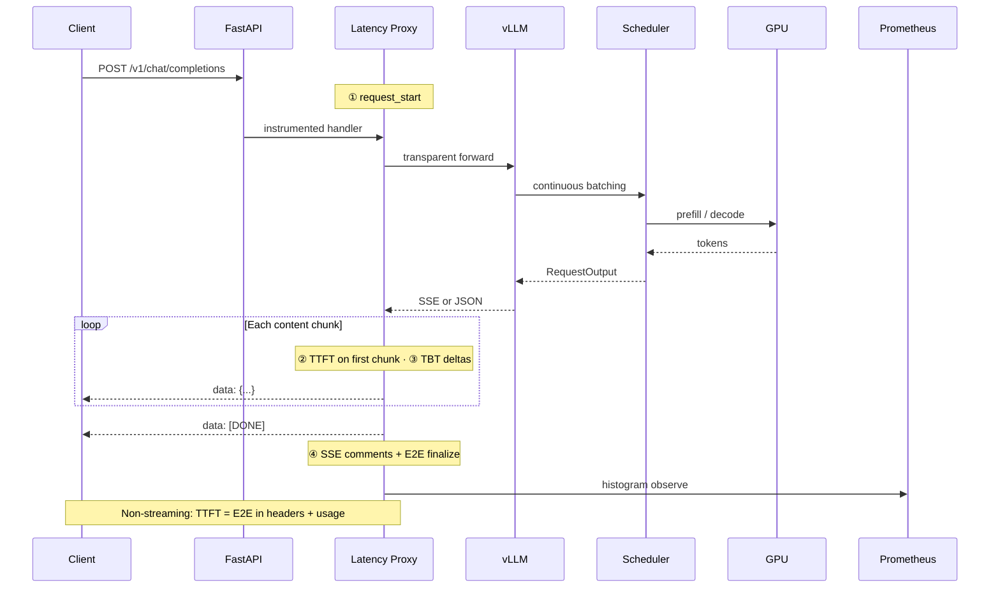
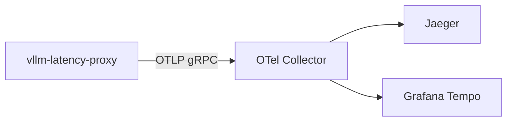
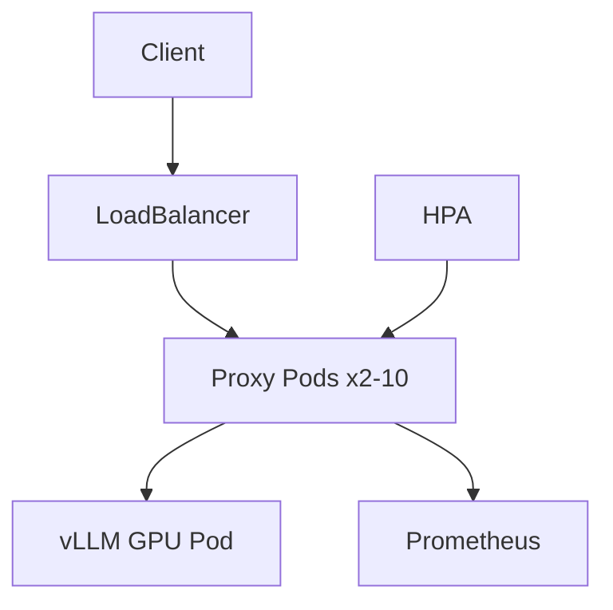

# vLLM Latency Metrics

[](https://github.com/your-username/vllm-latency-metrics/actions)
[](https://www.python.org/)
[](https://fastapi.tiangolo.com/)
[](docker/docker-compose.yml)
[](docs/API.md)
[](LICENSE)

> **Server-side TTFT, TBT, and end-to-end latency for vLLM — in every API response, with zero client changes.**

---

## At a glance

| | |
|---|---|
| **Problem** | API clients cannot read authoritative TTFT/TBT from vLLM responses |
| **Solution** | Transparent latency proxy + optional upstream engine patch |
| **Deploy time** | ~2 min (Docker Compose, includes model download) |
| **Proxy overhead** | ≤ 4% RPS · ≤ 31 ms TTFT P99 @ 5 concurrent (measured) |
| **Tests** | 51 passing (unit · integration · concurrent · regression · E2E) |
| **Stack** | vLLM · FastAPI · Prometheus · Grafana · OpenTelemetry · Kubernetes / Helm |

### TL;DR — three commands to a working demo

```bash
git clone https://github.com/your-username/vllm-latency-metrics.git && cd vllm-latency-metrics
docker compose -f docker/docker-compose.yml up -d --build   # wait ~2 min for model load
curl -s http://localhost:8080/health && curl -s http://localhost:8080/v1/chat/completions \
  -H "Content-Type: application/json" \
  -d '{"model":"facebook/opt-1.3b","messages":[{"role":"user","content":"Hi"}],"max_tokens":5}'
```

<details>
<summary><strong>Windows (PowerShell)</strong></summary>

```powershell
git clone https://github.com/your-username/vllm-latency-metrics.git; cd vllm-latency-metrics
$env:PROXY_PORT="8081"   # if port 8080 is in use
docker compose -f docker/docker-compose.yml up -d --build
curl http://localhost:8080/health
```

</details>

---

## Table of contents

- [Why this exists](#why-this-exists)
- [When to use it](#when-to-use-it)
- [Key features](#key-features)
- [Architecture](#architecture)
- [Quick start](#quick-start)
- [API examples](#api-examples)
- [Latency metrics](#latency-metrics)
- [Observability](#observability)
- [OpenTelemetry](#opentelemetry)
- [Benchmarks](#benchmarks)
- [Upstream vLLM integration](#upstream-vllm-integration)
- [Testing](#testing)
- [Production deployment](#production-deployment)
- [Development](#development)
- [Design decisions](#design-decisions)
- [Troubleshooting](#troubleshooting)
- [Known limitations](#known-limitations)
- [Roadmap](#roadmap)
- [Contributing](#contributing)

---

## Why this exists

LLM serving quality is measured by **time-to-first-token (TTFT)** and **time-between-tokens (TBT)**. vLLM optimizes GPU throughput internally, but its OpenAI-compatible API does not expose per-request latency in responses. Every team reinvents client-side timers — inconsistent methodology, no SLO enforcement, no server-side ground truth.

**This project provides:**

1. **Latency proxy** — FastAPI sidecar wrapping any vLLM endpoint. Injects latency into headers, `usage` fields, and SSE comments. Exports Prometheus histograms. **No vLLM source changes.**
2. **Upstream patch** ([`vllm_patch/`](vllm_patch/)) — Annotated integration into `RequestOutput`, the async engine, and the OpenAI serving layer for GPU-authoritative measurement.

---

## When to use it

| Use the **proxy** when… | Use the **engine patch** when… |
|-------------------------|--------------------------------|
| You need latency metrics today without forking vLLM | You are contributing upstream or need scheduler-bound TTFT |
| You want client-visible latency (includes network hop) | You need queue-time vs compute-time separation |
| You run any vLLM version (≥ 0.4.x tested) | You control the vLLM build and release cycle |

**Do not use the proxy as a replacement for vLLM** — it adds ~0–2 ms local hop latency and measures at the HTTP boundary, not inside the CUDA kernel.

---

## Key features

- TTFT · TBT (mean + P99) · E2E latency on every instrumented request
- OpenAI-compatible `/v1/chat/completions` and `/v1/completions`
- Streaming SSE passthrough with latency comment lines after `[DONE]`
- Prometheus histograms · Grafana dashboard · TTFT/TBT alert rules
- Docker Compose full stack · Kubernetes manifests · Helm chart
- NVIDIA GPU via vLLM (validated on T1000 8 GB Turing and Docker + CUDA)
- 51 automated tests · reproducible benchmark suite

---

## Architecture



| Stage | Where | Metric |
|-------|-------|--------|
| Admission | `StreamLatencyTracker` init | Start time |
| First token | `on_content_token()` | TTFT |
| Later tokens | Incremental + 256-sample reservoir | Mean / P99 TBT |
| Completion | `finalize()` after `[DONE]` yield | E2E |
| Roll-up | `/metrics` · `/latency/stats` | P50 / P95 / P99 |

<details>
<summary><strong>Repository layout</strong></summary>

| Path | Purpose |
|------|---------|
| [`proxy.py`](proxy.py) | Production FastAPI proxy (v1.2) |
| [`vllm_patch/`](vllm_patch/) | Upstream `LatencyMetrics` + engine integration guide |
| [`docker/`](docker/) | Dockerfile · Compose · Prometheus · Grafana |
| [`monitoring/`](monitoring/) | Dashboard JSON · alerting rules |
| [`benchmarks/`](benchmarks/) | E2E sweeps · hot-path micro-benchmarks |
| [`tests/`](tests/) | Unit · integration · concurrent · E2E |
| [`k8s/`](k8s/) · [`helm/`](helm/vllm-latency-metrics/) | Production manifests |
| [`docs/API.md`](docs/API.md) | Full API reference |

</details>

---

## Quick start

### Prerequisites

- [Docker](https://docs.docker.com/get-docker/) + [NVIDIA Container Toolkit](https://docs.nvidia.com/datacenter/cloud-native/container-toolkit/latest/install-guide.html) (for GPU)
- Python 3.10+ (optional — for local tests only)
- HuggingFace token (optional for `facebook/opt-1.3b`)

### Install and run

```bash
git clone https://github.com/your-username/vllm-latency-metrics.git
cd vllm-latency-metrics

export VLLM_MODEL=facebook/opt-1.3b          # optional: export HF_TOKEN=hf_...
export PROXY_PORT=8080                       # use 8081 if 8080 is occupied

docker compose -f docker/docker-compose.yml up -d --build
# Wait ~2 minutes for vLLM to load weights, then:
make smoke-test VLLM_URL=http://localhost:${PROXY_PORT:-8080}
```

### Services

| Service | URL | Role |
|---------|-----|------|
| vLLM | http://localhost:8000 | Raw LLM server |
| **Proxy** | http://localhost:8080 | **← send API requests here** |
| Prometheus | http://localhost:9090 | Metrics |
| Grafana | http://localhost:3000 | Dashboards (`admin` / `admin`) |

```bash
make stack-logs    # tail all services
make stack-down    # stop
```

<details>
<summary><strong>Proxy only (vLLM already running)</strong></summary>

```bash
make docker-build
docker run --rm -p 8080:8080 \
  -e VLLM_BASE_URL=http://host.docker.internal:8000 \
  vllm-latency-proxy:latest
```

</details>

<details>
<summary><strong>Environment variables</strong></summary>

| Variable | Default | Description |
|----------|---------|-------------|
| `HF_TOKEN` | — | HuggingFace token |
| `VLLM_MODEL` | `facebook/opt-1.3b` | Model for vLLM |
| `PROXY_PORT` | `8080` | Host port for proxy |
| `VLLM_BASE_URL` | `http://vllm:8000` | Upstream URL (in Compose) |
| `STATS_WINDOW` | `1000` | Rolling stats window |
| `MAX_TBT_PROMETHEUS_SAMPLES` | `256` | TBT histogram cap per request |

</details>

---

## API examples

Full reference: [`docs/API.md`](docs/API.md)

### Non-streaming

```bash
curl -si http://localhost:8080/v1/chat/completions \
  -H "Content-Type: application/json" \
  -d '{"model":"facebook/opt-1.3b","messages":[{"role":"user","content":"What is 2+2?"}],"max_tokens":32}'
```

```http
x-vllm-ttft-ms: 342.1
x-vllm-e2e-latency-ms: 1823.4
```

```json
"usage": {
  "prompt_tokens": 12, "completion_tokens": 1, "total_tokens": 13,
  "ttft_ms": 342.1, "mean_tbt_ms": null, "p99_tbt_ms": null, "e2e_latency_ms": 1823.4
}
```

### Streaming

```bash
curl -N http://localhost:8080/v1/chat/completions \
  -H "Content-Type: application/json" \
  -d '{"model":"facebook/opt-1.3b","messages":[{"role":"user","content":"Count to five."}],"max_tokens":50,"stream":true}'
```

```
data: {"choices":[{"delta":{"content":"One"},"index":0}]}
...
data: [DONE]
: x-vllm-ttft-ms=188.000
: x-vllm-mean-tbt-ms=142.790
: x-vllm-p99-tbt-ms=143.860
: x-vllm-e2e-latency-ms=4375.000
```

Latency comments appear **after** `data: [DONE]` — the terminal chunk is never blocked on metric computation.

---

## Latency metrics

| Metric | Definition |
|--------|------------|
| **TTFT** | Request admission → first SSE chunk with generative content |
| **TBT** | Inter-arrival time between consecutive content chunks (mean + P99) |
| **E2E** | Request start → stream / response complete |

- Timestamps: `time.monotonic()` (delta-safe).
- **Streaming:** per-chunk tracking; P99 TBT via 256-sample reservoir (bounded memory).
- **Non-streaming:** TTFT = E2E; TBT fields are `null`.

| | Proxy (sidecar) | Engine patch |
|---|-----------------|--------------|
| Boundary | HTTP / client-visible | Scheduler / GPU |
| TTFT includes | Proxy ↔ vLLM hop | Queue + prefill |
| Install | Zero code changes | vLLM source patch |

---

## Observability

### Prometheus — `GET /metrics`

| Metric | Type | Description |
|--------|------|-------------|
| `vllm_proxy_ttft_milliseconds` | Histogram | TTFT (ms) |
| `vllm_proxy_tbt_milliseconds` | Histogram | TBT per pair (ms) |
| `vllm_proxy_e2e_latency_seconds` | Histogram | E2E (s) |
| `vllm_proxy_requests_total` | Counter | By endpoint + status |
| `vllm_proxy_active_requests` | Gauge | In-flight (leak-tested) |

```promql
histogram_quantile(0.99, rate(vllm_proxy_ttft_milliseconds_bucket[5m]))
sum(rate(vllm_proxy_requests_total{status="200"}[1m]))
vllm_proxy_active_requests
```

Alerts: [`monitoring/alerts.yml`](monitoring/alerts.yml) — TTFT P99 > 2 s (warning) · > 5 s (critical).

**Example SLO:** *TTFT P99 < 500 ms at concurrency ≤ 10* — alert fires via `HighTTFT` rule after 5 min breach.

### Grafana — http://localhost:3000

Auto-provisioned dashboard: **vLLM Latency Metrics** ([`latency-metrics.json`](monitoring/grafana/dashboards/latency-metrics.json))

| Panel | Shows |
|-------|-------|
| TTFT P50 / P95 / P99 | First-token responsiveness |
| TBT P50 / P99 | Streaming smoothness |
| Requests / sec | Throughput |
| Active requests | Backpressure |
| E2E P99 | Total duration |

Run `make benchmark` then open Grafana to watch panels update live. GPU metrics require `nvidia-smi` or DCGM separately — the proxy does not export GPU utilization.

---

## OpenTelemetry

Optional distributed tracing via OTLP — complements Prometheus with **per-request latency waterfalls**.



| Span | Captures |
|------|----------|
| `inference.request` | Client → proxy admission |
| `vllm.upstream` | Proxy → vLLM HTTP |
| `first_token` event | TTFT timestamp |
| `completion` event | Full latency breakdown |

```bash
# Enable locally (Jaeger UI on :16686)
docker compose -f docker/docker-compose.yml -f docker/docker-compose.otel.yml up -d --build

# Helm
helm install latency-metrics ./helm --set opentelemetry.enabled=true
```

Response headers when enabled: `x-trace-id`, `x-span-id`. See [docs/opentelemetry.md](docs/opentelemetry.md).

---

## Benchmarks

**Hardware:** NVIDIA T1000 8 GB · `facebook/opt-1.3b` · 30 tokens · streaming · 2026-06-29  
**Artifacts:** [`benchmarks/results/`](benchmarks/results/)

### E2E: vLLM direct vs proxy

| C | Endpoint | Req/s | TTFT P50 | TTFT P95 | TTFT P99 | TBT P99 | Err |
|:-:|----------|------:|---------:|---------:|---------:|--------:|----:|
| 1 | vLLM `:8000` | 0.24 | 188 ms | 203 ms | 203 ms | 148 ms | 0% |
| 1 | Proxy `:8080` | 0.23 | 188 ms | 203 ms | 203 ms | 144 ms | 0% |
| 5 | vLLM `:8000` | 1.03 | 672 ms | 813 ms | 813 ms | 164 ms | 0% |
| 5 | Proxy `:8080` | 1.02 | 734 ms | 844 ms | 844 ms | 159 ms | 0% |

| C | RPS Δ | TTFT P99 Δ |
|:-:|------:|-----------:|
| 1 | −4.2% | 0 ms |
| 5 | −1.0% | +31 ms |

**Finding:** Bottleneck is GPU inference and vLLM batch scheduling — not proxy Python overhead.

### Hot-path micro-benchmarks ([`perf_review.py`](benchmarks/perf_review.py))

| Operation | P99 | vs baseline |
|-----------|----:|-------------|
| SSE role-only fast path | 0.7 ms | **4.6×** faster |
| Body stream detection | 0.9 ms | **3.2×** faster |
| Finalize 2048 tokens (reservoir) | 34 ms | −63% vs full-list |
| Stats insert | 1.0 ms | 1.18 M ops/s |
| Client stall before `[DONE]` | — | **eliminated** |

### OpenTelemetry overhead

With OTel **disabled** (default), tracing is a no-op on the hot path. When enabled, span export adds ~10–50 µs per request via BatchSpanProcessor — negligible vs GPU TTFT (100–800 ms).

```bash
pytest tests/test_telemetry.py -v   # noop path when OTEL_ENABLED unset
```

### Reproduce

```bash
python benchmarks/run_benchmark.py --base-url http://localhost:8000 --concurrency 1 5 --requests-per-level 15
python benchmarks/run_benchmark.py --base-url http://localhost:8080 --concurrency 1 5 --requests-per-level 15
python benchmarks/run_benchmark.py --compare benchmarks/results/benchmark_<a>.json benchmarks/results/benchmark_<b>.json
python benchmarks/perf_review.py
```

---

## Upstream vLLM integration

For maintainers evaluating an upstream merge — the patch is **additive and backward-compatible**.

| File (vLLM) | Change |
|-------------|--------|
| `vllm/outputs.py` | `LatencyMetrics` dataclass + `RequestOutput.latency` |
| `vllm/engine/async_llm_engine.py` | Stamp start time · `record_token()` per output |
| `vllm/entrypoints/openai/serving_chat.py` | Inject headers + extended `usage` |
| `vllm/entrypoints/openai/protocol.py` | Optional `ttft_ms` / `mean_tbt_ms` / `p99_tbt_ms` on `UsageInfo` |

- **OpenAI compat:** new `usage` fields are optional; existing clients unchanged.
- **Header namespace:** `x-vllm-*` avoids collision with standard HTTP headers.
- **Overhead target:** O(1) per token on engine path (incremental TBT; reservoir P99).
- **PR template:** [`docs/PR_DESCRIPTION.md`](docs/PR_DESCRIPTION.md)
- **Annotated diffs:** [`vllm_patch/engine_patch.py`](vllm_patch/engine_patch.py)

**Tested vLLM versions (proxy sidecar):** `v0.4.3` (Docker Compose pin). Proxy is version-agnostic for any OpenAI-compatible vLLM release.

---

## Testing

| Suite | Marker | What it verifies |
|-------|--------|------------------|
| Unit | `unit` | Math, percentiles, tracker, SSE fast-path |
| Integration | `integration` | Headers, usage, mocked upstream |
| Regression | `regression` | OpenAI field compatibility |
| Concurrent | `integration` | 20 parallel reqs · gauge leak |
| E2E | `e2e` | Live vLLM TTFT + SSE comments |
| Benchmark | `benchmark` | 10k+ tracker ops/s |

```bash
pytest tests/ -m "unit or integration or regression" -v   # 46 tests, no GPU
VLLM_E2E_URL=http://localhost:8080 make test-e2e          # +3 tests, needs stack
make test-cov
```

---

## Production deployment

### Architecture (Kubernetes)



Full guides: [deployment-guide.md](docs/deployment-guide.md) · [k8s-deployment.md](docs/k8s-deployment.md) · [multi-node-architecture.md](docs/multi-node-architecture.md)

### Kubernetes (kubectl + Kustomize)

```bash
kubectl create namespace vllm
kubectl create secret generic hf-token --from-literal=HF_TOKEN=$HF_TOKEN -n vllm
kubectl apply -k k8s/                    # modular manifests
kubectl apply -k k8s/ --dry-run=client   # validate
kubectl get svc vllm-latency-proxy -n vllm
```

Manifests: `k8s/namespace.yaml`, `configmap.yaml`, `vllm-deployment.yaml`, `proxy-deployment.yaml`, `hpa.yaml`, etc.

### Helm (one command)

```bash
helm install latency-metrics ./helm -n vllm --create-namespace \
  --set vllm.model=facebook/opt-1.3b \
  --set proxy.replicaCount=2 \
  --set proxy.image.repository=ghcr.io/your-username/vllm-latency-proxy \
  --set proxy.image.tag=1.2.0

# With monitoring + tracing
helm install latency-metrics ./helm -n vllm \
  --set prometheus.enabled=true \
  --set grafana.enabled=true \
  --set opentelemetry.enabled=true
```

### Multi-proxy load balancing (local demo)

```bash
docker compose -f docker/docker-compose.yml up -d vllm
docker compose -f docker/docker-compose.multi.yml up -d --build
curl http://localhost:8888/health   # nginx → 2 proxy replicas
```

Point clients at the **proxy** Service, not vLLM directly. Configure Prometheus to scrape `proxy:8080/metrics`.

Checklist: [production-readiness-checklist.md](docs/production-readiness-checklist.md) · Troubleshooting: [troubleshooting-k8s.md](docs/troubleshooting-k8s.md)

---

## Development

```bash
pip install -r requirements-dev.txt
make lint format typecheck
make benchmark VLLM_URL=http://localhost:8080
docker compose -f docker/docker-compose.yml logs -f proxy
make docker-build && docker compose -f docker/docker-compose.yml up -d --build proxy
```

Add shared logic in [`vllm_patch/latency_utils.py`](vllm_patch/latency_utils.py) · proxy behaviour in [`proxy.py`](proxy.py) · tests with pytest markers.

---

## Design decisions

| Question | Answer |
|----------|--------|
| **Why a proxy?** | Zero-friction deploy against any vLLM version; measures client-visible latency |
| **Why `RequestOutput`?** | Canonical scheduler → API artifact; avoids parallel registries |
| **Why SSE comments?** | HTTP headers are sent before body completes; comments are spec-valid and ignored by `EventSource` |
| **Why Prometheus?** | Standard ML infra stack; histograms → Grafana → Alertmanager |

| Trade-off | Benefit | Cost |
|-----------|---------|------|
| Sidecar proxy | No vLLM fork | +0–2 ms local hop in TTFT |
| 256-sample TBT reservoir | O(1) memory | Approximate P99 on very long streams |
| Additive `usage` fields | Backward compatible | Non-streaming TBT is always `null` |

---

## Troubleshooting

| Symptom | Cause | Fix |
|---------|-------|-----|
| `connection refused` on `:8080` | Stack not ready or port conflict | Wait 2 min; set `PROXY_PORT=8081` |
| Proxy unhealthy, vLLM healthy | vLLM still loading model | Check `docker logs vllm` — wait for `Uvicorn running` |
| `HF_TOKEN` warnings | Token not set | Export token or use public model `opt-1.3b` |
| `make: command not found` (Windows) | Make not installed | Use `docker compose` commands directly (see Quick start) |
| `uvloop` pip error (Windows) | uvloop is Linux-only | Use Docker or `pip install fastapi uvicorn httpx prometheus-client` |
| No latency in stream | Hitting `:8000` not `:8080` | Route through proxy |
| Grafana empty | No traffic yet | Run `make smoke-test` or `make benchmark` |

```bash
docker compose -f docker/docker-compose.yml ps
docker logs vllm --tail 30
curl -s http://localhost:8080/health | python -m json.tool
```

---

## Known limitations

- Proxy TTFT includes proxy ↔ vLLM network hop
- Non-streaming TBT is always `null`
- Streaming latency is in SSE comments, not HTTP headers
- P99 TBT is reservoir-sampled (256) — approximate for 256+ intervals
- Rolling `/latency/stats` is in-memory (1000-request window)
- Single-GPU Compose ≠ multi-node production throughput
- Engine patch still uses full timestamp lists — align with reservoir tracker before upstream merge

---

## Roadmap

- [ ] Upstream merge of `LatencyMetrics` into vLLM core
- [ ] Incremental engine hot-path tracking (no per-token list)
- [x] OpenTelemetry + distributed tracing
- [x] Kubernetes modular manifests + Helm chart
- [x] Multi-node architecture design + proxy LB demo
- [ ] Multi-GPU / tensor-parallel latency attribution
- [ ] HPA on TTFT P99 · DCGM Grafana panels
- [ ] Locust / k6 load-test harness with CSV + graphs

---

## Acknowledgements

[vLLM](https://github.com/vllm-project/vllm) · [Prometheus](https://prometheus.io/) · [Grafana](https://grafana.com/) · [FastAPI](https://fastapi.tiangolo.com/) · [Docker](https://www.docker.com/)
