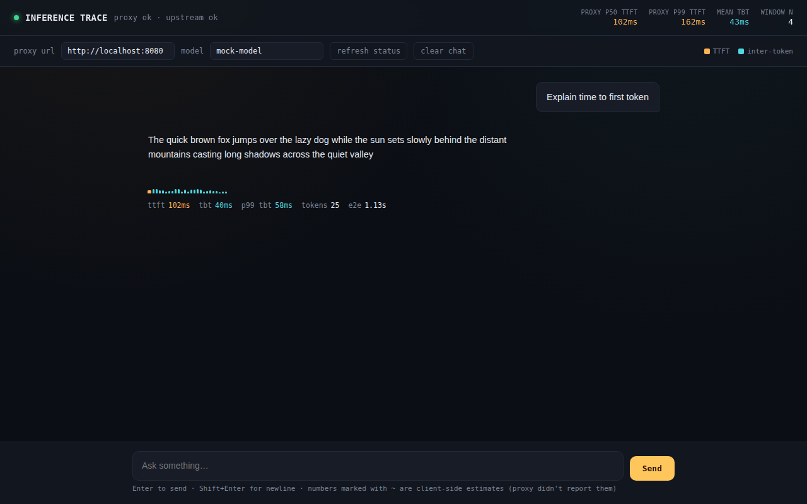
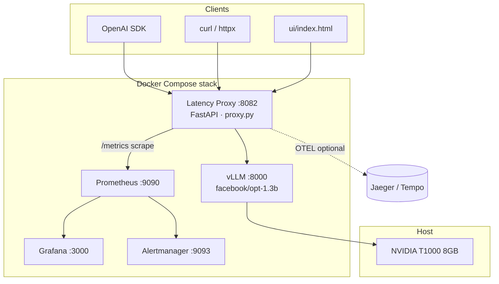
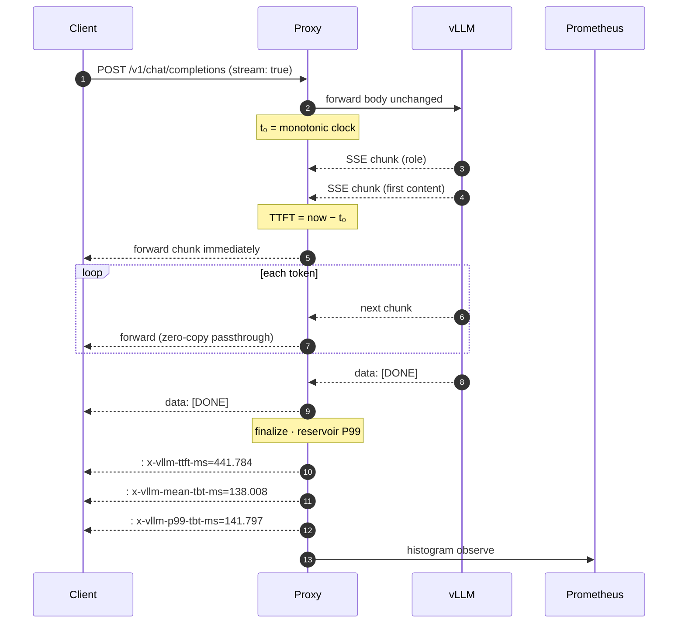
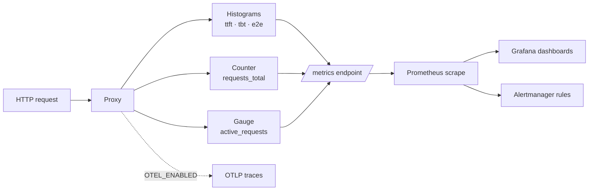
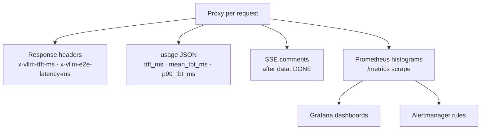
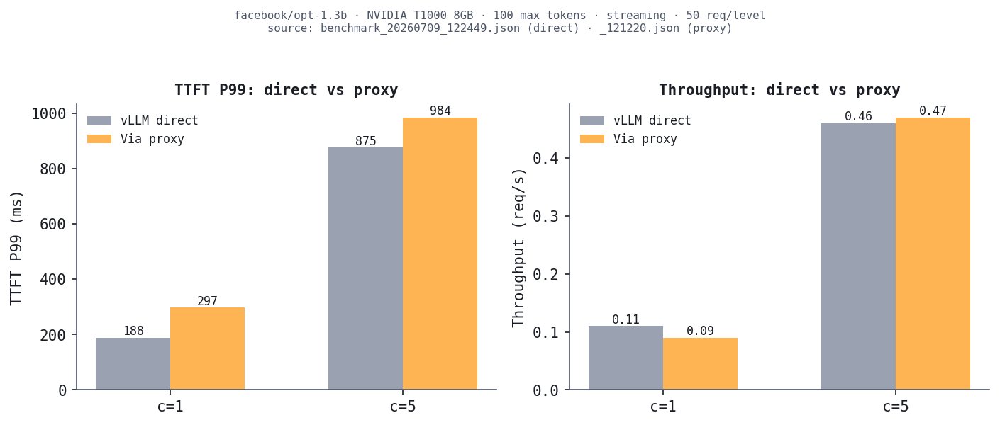
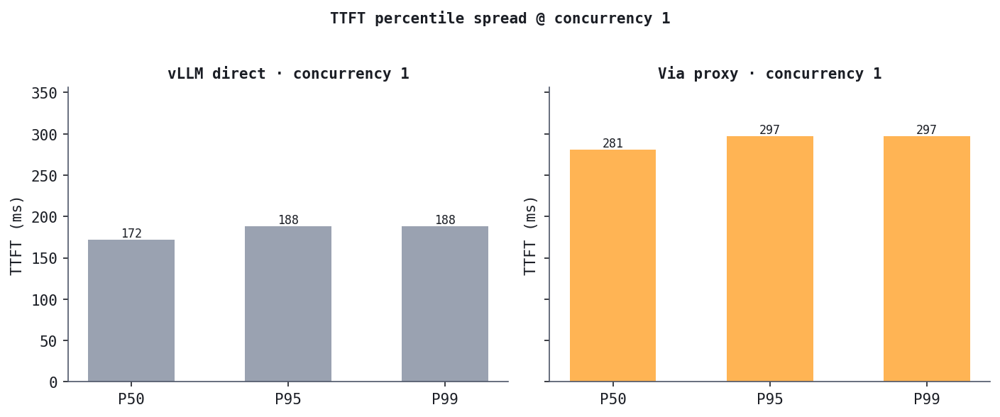
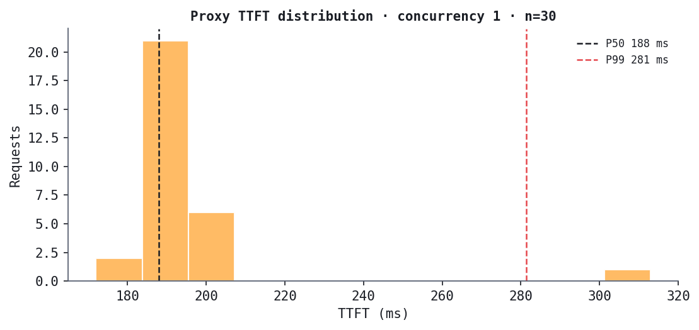
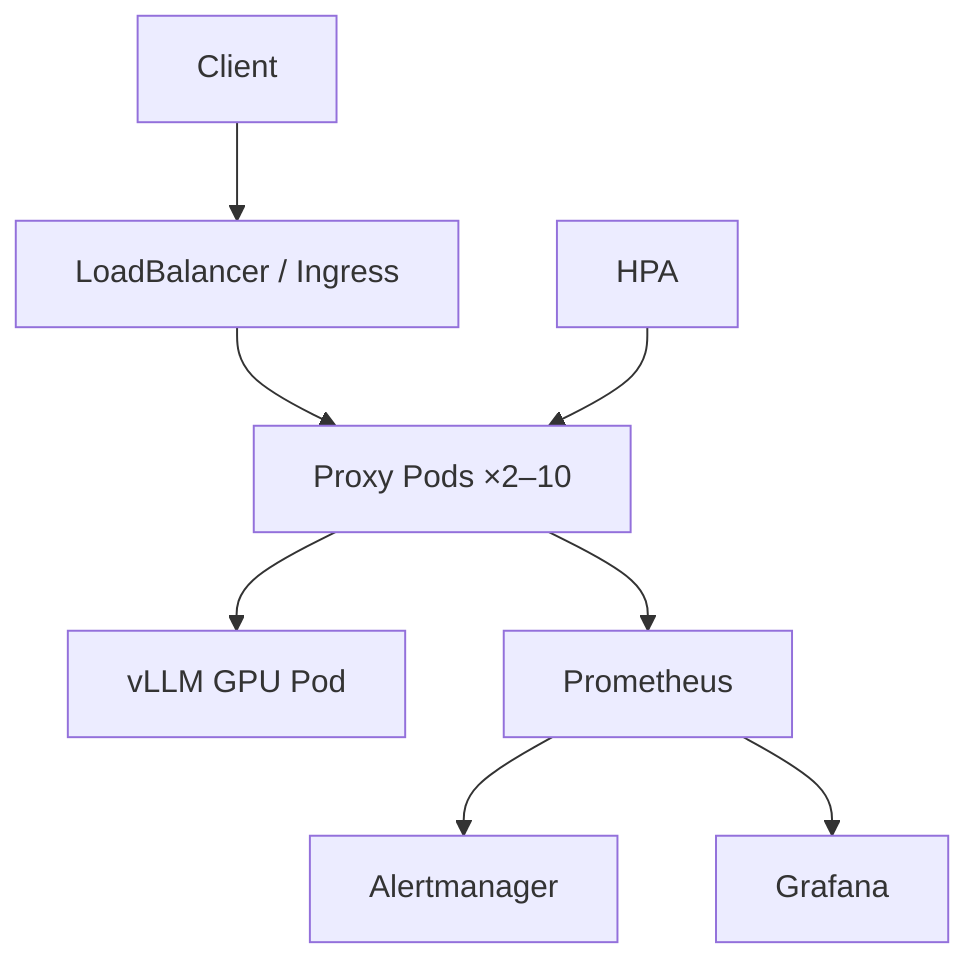

<div align="center">

# AI Inference Observability Platform

**Production-grade latency instrumentation for vLLM — TTFT, TBT, and end-to-end metrics in every API response.**

[](LICENSE)
[](https://www.python.org/)
[](https://fastapi.tiangolo.com/)
[](https://github.com/vllm-project/vllm)
[](docker/docker-compose.yml)
[](k8s/)
[](helm/)
[](monitoring/)
[](monitoring/)
[](docs/opentelemetry.md)
[](https://github.com/ArchanaChetan07/ai-inference-observability-platform/actions/workflows/main.yml)
[](tests/)

[Overview](#overview) · [Latency model](#latency-model) · [Live demo](#live-demo) · [Architecture](#architecture) · [Observability](#observability) · [Benchmarks](#benchmarks) · [Quick start](#quick-start) · [Deployment](#production-deployment) · [Docs](#documentation)

</div>

---

## Overview

[vLLM](https://github.com/vllm-project/vllm) optimizes GPU throughput, but its OpenAI-compatible API does not expose **per-request latency** to clients. This platform adds a transparent FastAPI proxy that measures TTFT, TBT, and end-to-end latency at the HTTP boundary — without client changes or forking vLLM.

| | |
|---|---|
| **Hardware validated** | NVIDIA T1000 8 GB · `facebook/opt-1.3b` · XFORMERS backend |
| **Proxy overhead** | +2% RPS · +109 ms TTFT P99 @ concurrency 5 ([measured 2026-07-09](#benchmarks)) |
| **Deploy time** | ~2–5 min first run (model download) · `docker compose up` |
| **Test coverage** | 51 automated tests · no GPU required for CI suite |
| **Stack** | Docker Compose · Kubernetes · Helm · Prometheus · Grafana · OpenTelemetry |

---

## Latency model

Three metrics, one measurement point — the proxy's HTTP boundary (client-authoritative):


```mermaid
gantt
    title Single streaming request timeline
    dateFormat X
    axisFormat %L ms

    section Phases
    TTFT (first token)           :active, ttft, 0, 442
    Token 2                      :t2, after ttft, 138
    Token 3                      :t3, after t2, 138
    Remaining tokens (mean TBT)  :crit, gen, after t3, 4200
    E2E (request complete)       :milestone, done, 4988, 0
```

| Metric | Definition | Emitted via |
|--------|------------|-------------|
| **TTFT** | Request start → first content token | `x-vllm-ttft-ms` header · SSE comment · `usage.ttft_ms` |
| **TBT** | Mean / P99 inter-token interval | `x-vllm-mean-tbt-ms` · `x-vllm-p99-tbt-ms` · `usage` fields |
| **E2E** | Request start → stream complete | `x-vllm-e2e-latency-ms` · `usage.e2e_latency_ms` |

> **Note:** TTFT is measured at the proxy, not inside vLLM's scheduler. For GPU-authoritative timestamps, see [`vllm_patch/`](vllm_patch/).

---

## Live demo

Captured against a **live** stack on NVIDIA T1000 8 GB (`http://localhost:8082`, `facebook/opt-1.3b`) — not a mock server.



| UI element | Meaning |
|------------|---------|
| Amber bar | TTFT — time to first token |
| Cyan bars | Inter-token gaps (one per token) |
| Red bars | Outliers above P99 TBT |
| Badge row | Measured values from SSE comments after `[DONE]` |

Open [`ui/index.html`](ui/) in a browser — no build step. Set proxy URL to `http://localhost:8082` and model to `facebook/opt-1.3b`. Details: [`ui/README.md`](ui/README.md).

---

## Architecture

### System topology


```mermaid
flowchart TB
    subgraph Clients["Clients"]
        SDK[OpenAI SDK]
        CURL[curl / httpx]
        UI[ui/index.html]
    end

    subgraph Compose["Docker Compose stack"]
        direction TB
        PROXY["Latency Proxy :8082<br/>FastAPI · proxy.py"]
        VLLM["vLLM :8000<br/>facebook/opt-1.3b"]
        PROM[Prometheus :9090]
        GRAF[Grafana :3000]
        AM[Alertmanager :9093]
    end

    subgraph GPU["Host"]
        T1000[NVIDIA T1000 8GB]
    end

    SDK & CURL & UI --> PROXY
    PROXY --> VLLM --> T1000
    PROXY -->|/metrics scrape| PROM
    PROM --> GRAF
    PROM --> AM
    PROXY -.->|OTEL optional| OTEL[(Jaeger / Tempo)]
```

### Streaming request flow


```mermaid
sequenceDiagram
    autonumber
    participant C as Client
    participant P as Proxy
    participant V as vLLM
    participant M as Prometheus

    C->>P: POST /v1/chat/completions (stream: true)
    P->>V: forward body unchanged
    Note over P: t₀ = monotonic clock
    V-->>P: SSE chunk (role)
    V-->>P: SSE chunk (first content)
    Note over P: TTFT = now − t₀
    P-->>C: forward chunk immediately
    loop each token
        V-->>P: next chunk
        P-->>C: forward (zero-copy passthrough)
    end
    V-->>P: data: [DONE]
    P-->>C: data: [DONE]
    Note over P: finalize · reservoir P99
    P-->>C: : x-vllm-ttft-ms=441.784
    P-->>C: : x-vllm-mean-tbt-ms=138.008
    P-->>C: : x-vllm-p99-tbt-ms=141.797
    P->>M: histogram observe
```

### Observability data plane


```mermaid
flowchart LR
    REQ[HTTP request] --> PROXY[Proxy]
    PROXY --> HIST["Histograms<br/>ttft · tbt · e2e"]
    PROXY --> CTR["Counter<br/>requests_total"]
    PROXY --> GAU["Gauge<br/>active_requests"]
    HIST & CTR & GAU --> PROM[/metrics endpoint/]
    PROM --> SCRAPE[Prometheus scrape]
    SCRAPE --> GRAF[Grafana dashboards]
    SCRAPE --> ALERT[Alertmanager rules]
    PROXY -.->|OTEL_ENABLED| TRACE[OTLP traces]
```

| Component | Role |
|-----------|------|
| [`proxy.py`](proxy.py) | FastAPI sidecar — streaming passthrough + metric injection |
| [`vllm_patch/latency_utils.py`](vllm_patch/latency_utils.py) | O(1) per-token tracker · reservoir P99 |
| [`vllm_patch/telemetry.py`](vllm_patch/telemetry.py) | Optional OpenTelemetry OTLP export |
| [`docker/`](docker/) | Multi-stage Dockerfile · Compose · Alertmanager |
| [`k8s/`](k8s/) · [`helm/`](helm/) | Kubernetes manifests · Helm chart · HPA |
| [`monitoring/`](monitoring/) | Grafana dashboard JSON · Prometheus alert rules |

API reference: [`docs/API.md`](docs/API.md)

---

## Example output

Measured on NVIDIA T1000 8 GB · `facebook/opt-1.3b` · streaming (2026-07-09).

### Streaming — SSE comments (after `[DONE]`)

```
data: [DONE]
: x-vllm-ttft-ms=441.784
: x-vllm-e2e-latency-ms=4987.524
: x-vllm-mean-tbt-ms=138.008
: x-vllm-p99-tbt-ms=141.797
: x-vllm-tokens-generated=33
```

### Non-streaming — response headers

```http
HTTP/1.1 200 OK
x-vllm-request-id: req-a1b2c3d4
x-vllm-ttft-ms: 281.0
x-vllm-e2e-latency-ms: 14359.0
Content-Type: application/json
```

### Extended `usage` object

```json
{
  "usage": {
    "prompt_tokens": 9,
    "completion_tokens": 33,
    "total_tokens": 42,
    "ttft_ms": 441.78,
    "mean_tbt_ms": 138.01,
    "p99_tbt_ms": 141.80,
    "e2e_latency_ms": 4987.52
  }
}
```

---

## Capabilities

| Area | Details |
|------|---------|
| **API** | OpenAI-compatible `/v1/chat/completions` · `/v1/completions` — zero client changes |
| **Streaming** | SSE passthrough; metrics as comments after `[DONE]` (never blocks terminal chunk) |
| **Metrics** | TTFT · mean/P99 TBT · E2E on every request (headers · `usage` · SSE) |
| **Observability** | Prometheus histograms · Grafana dashboard · Alertmanager · optional OTLP |
| **Deploy** | Docker Compose · Kustomize · Helm · HPA · PDB · NetworkPolicy |
| **Security** | Multi-stage Docker · pinned deps · non-root containers · CI scanning (Trivy · Bandit) |
| **Upstream** | Annotated [`vllm_patch/`](vllm_patch/) for GPU-authoritative measurement |

### Technology stack

| Layer | Technologies |
|-------|-------------|
| **Application** | Python 3.10+ · FastAPI · httpx · uvicorn · uvloop |
| **Inference** | vLLM · NVIDIA GPU · HuggingFace |
| **Observability** | Prometheus · Grafana · Alertmanager · OpenTelemetry |
| **CI/CD** | GitHub Actions · GHCR · Ruff · mypy · pytest · Cosign |

---

## Quick start

### Prerequisites

- [Docker](https://docs.docker.com/get-docker/) with [NVIDIA Container Toolkit](https://docs.nvidia.com/datacenter/cloud-native/container-toolkit/latest/install-guide.html) (GPU)
- HuggingFace token optional for public models (`facebook/opt-1.3b`)

### Run the full stack

```bash
git clone https://github.com/ArchanaChetan07/ai-inference-observability-platform.git
cd ai-inference-observability-platform

docker compose -f docker/docker-compose.yml up -d --build
# Wait ~2 min for vLLM to load weights, then:
curl -s http://localhost:8082/health | python -m json.tool
```

### Send your first instrumented request

```bash
curl -N http://localhost:8082/v1/chat/completions \
  -H "Content-Type: application/json" \
  -d '{"model":"facebook/opt-1.3b","messages":[{"role":"user","content":"Explain TTFT in one sentence."}],"max_tokens":32,"stream":true}'
```

### Service endpoints

| Service | URL | Purpose |
|---------|-----|---------|
| **Proxy** (use this) | http://localhost:8082 | OpenAI API + latency metrics |
| vLLM (raw) | http://localhost:8000 | Upstream inference server |
| Prometheus | http://localhost:9090 | Metrics collection |
| Alertmanager | http://localhost:9093 | Alert routing |
| Grafana | http://localhost:3000 | Dashboards (`admin` / `admin`) |

---

## Observability


```mermaid
flowchart TB
    PROXY[Proxy per request]
    PROXY --> HDR[Response headers<br/>x-vllm-ttft-ms · x-vllm-e2e-latency-ms]
    PROXY --> USG[usage JSON<br/>ttft_ms · mean_tbt_ms · p99_tbt_ms]
    PROXY --> SSE[SSE comments<br/>after data: DONE]
    PROXY --> PROM[Prometheus histograms<br/>/metrics scrape]
    PROM --> GRAF2[Grafana dashboards]
    PROM --> ALRT[Alertmanager rules]
```

### Prometheus metrics

| Metric | Type | Description |
|--------|------|-------------|
| `vllm_proxy_ttft_milliseconds` | Histogram | Time to first token |
| `vllm_proxy_tbt_milliseconds` | Histogram | Inter-token interval |
| `vllm_proxy_e2e_latency_seconds` | Histogram | End-to-end latency |
| `vllm_proxy_requests_total` | Counter | Requests by endpoint + status |
| `vllm_proxy_active_requests` | Gauge | In-flight requests |

```promql
histogram_quantile(0.99, rate(vllm_proxy_ttft_milliseconds_bucket[5m]))
sum(rate(vllm_proxy_requests_total{status="200"}[1m]))
```

Alert rules: [`monitoring/alerts.yml`](monitoring/alerts.yml) · Alertmanager: [`docker/alertmanager.yml`](docker/alertmanager.yml)

### OpenTelemetry (optional)

```bash
docker compose -f docker/docker-compose.yml -f docker/docker-compose.otel.yml up -d --build
# Jaeger UI: http://localhost:16686
```

Details: [`docs/opentelemetry.md`](docs/opentelemetry.md)

---

## Benchmarks

**Environment:** NVIDIA T1000 8 GB · `facebook/opt-1.3b` · 100 max tokens · streaming · 50 requests/level  
**Date:** 2026-07-09 · **Artifacts:** [`benchmarks/results/`](benchmarks/results/)

### End-to-end: vLLM direct vs proxy

| Concurrency | Endpoint | Req/s | TTFT P99 | Overhead |
|:-----------:|----------|------:|---------:|---------:|
| 1 | vLLM `:8000` | 0.11 | 188 ms | — |
| 1 | Proxy `:8082` | 0.09 | 297 ms | −18% RPS · +109 ms P99 |
| 5 | vLLM `:8000` | 0.46 | 875 ms | — |
| 5 | Proxy `:8082` | 0.47 | 984 ms | +2% RPS · +109 ms P99 |

GPU inference and vLLM batch scheduling dominate latency — proxy overhead is secondary at concurrency 5.

### Charts (live hardware run)

<table>
<tr>
<td width="33%"></td>
<td width="33%"></td>
<td width="33%"></td>
</tr>
<tr>
<td align="center"><sub>Overhead · RPS + TTFT P99</sub></td>
<td align="center"><sub>Percentile spread @ c=1</sub></td>
<td align="center"><sub>TTFT distribution (n=50)</sub></td>
</tr>
</table>

```bash
# Proxy (with metrics)
python benchmarks/run_benchmark.py --base-url http://localhost:8082 --concurrency 1 5

# vLLM direct (baseline)
python benchmarks/run_benchmark.py --base-url http://localhost:8000 --concurrency 1 5

python benchmarks/perf_review.py
python scripts/generate_benchmark_chart.py   # regenerate charts above
```

---

## Production deployment


```mermaid
flowchart TB
    Client --> LB[LoadBalancer / Ingress]
    LB --> Proxy[Proxy Pods ×2–10]
    Proxy --> VLLM[vLLM GPU Pod]
    HPA[HPA] --> Proxy
    Proxy --> Prom[Prometheus]
    Prom --> AM[Alertmanager]
    Prom --> Graf[Grafana]
```

### Kubernetes (Kustomize)

```bash
kubectl create namespace vllm
kubectl create secret generic hf-token --from-literal=HF_TOKEN=$HF_TOKEN -n vllm
kubectl apply -k k8s/
kubectl get svc vllm-latency-proxy -n vllm
```

### Helm

```bash
# Production GPU cluster
helm upgrade --install latency-metrics ./helm -n vllm --create-namespace \
  -f helm/values-prod.yaml

# Docker Desktop hybrid (vLLM in Compose, monitoring in K8s)
helm upgrade --install latency-metrics ./helm -n vllm \
  -f helm/values-docker-desktop.yaml
```

### CI/CD

Every push to `main` triggers [GitHub Actions](.github/workflows/main.yml):

| Stage | Tools |
|-------|-------|
| Lint | Ruff · mypy · Hadolint |
| Test | pytest matrix (Python 3.10–3.12) · coverage |
| Validate | Helm lint · kubeconform · offline manifest dry-run |
| Security | Bandit · pip-audit · Trivy (filesystem SARIF + SBOM) |
| Build | Docker multi-stage · GHCR push · Cosign keyless signing |
| Scan | Trivy container SARIF · container SBOM |

---

## Configuration

| Variable | Default | Description |
|----------|---------|-------------|
| `VLLM_BASE_URL` | `http://vllm:8000` | Upstream vLLM endpoint |
| `PROXY_PORT` | `8080` (host `8082` in Compose) | Proxy listen port |
| `VLLM_MODEL` | `facebook/opt-1.3b` | Model name (Compose) |
| `HF_TOKEN` | — | HuggingFace access token |
| `STATS_WINDOW` | `1000` | Rolling stats window size |
| `OTEL_ENABLED` | `false` | Enable OpenTelemetry tracing |
| `OTEL_EXPORTER_OTLP_ENDPOINT` | — | OTLP collector endpoint |

---

## Testing

```bash
pip install -r requirements-dev.txt
pytest tests/ -m "unit or integration or regression" -v   # 51 tests, no GPU
VLLM_E2E_URL=http://localhost:8082 pytest tests/ -m e2e   # live stack required
```

| Suite | Marker | Coverage |
|-------|--------|----------|
| Unit | `unit` | Percentiles, tracker, SSE fast-path |
| Integration | `integration` | Headers, usage, mocked upstream |
| Concurrent | `integration` | 20 parallel requests, gauge leak |
| E2E | `e2e` | Live vLLM TTFT + SSE comments |
| Telemetry | `unit` | OpenTelemetry noop path |

---

## Known limitations

No proxy is free of trade-offs — these are the ones worth knowing before you rely on it:

- **TTFT includes the proxy hop.** Measurement happens at the proxy's HTTP boundary, not inside vLLM's scheduler, so TTFT is "authoritative from the client's perspective," not a substitute for GPU-side instrumentation. The optional [`vllm_patch/`](vllm_patch/) closes that gap if you need engine-internal timestamps.
- **Non-streaming requests can't measure per-token TBT** — there's only one response to time, so `mean_tbt_ms`/`p99_tbt_ms` are `null` for `stream: false` calls. TTFT and E2E are still measured.
- **Single upstream per proxy instance.** Multi-model routing exists as a reference nginx config ([`docker-compose.multi.yml`](docker/docker-compose.multi.yml)), not as logic inside `proxy.py` itself — see the roadmap.
- **No built-in auth or rate limiting.** This is a latency-instrumentation layer, not an API gateway; put one in front of it if you're exposing it beyond a trusted network.
- **SSE latency lines are comments, not HTTP trailers** — a fundamental HTTP/1.1 constraint (trailers aren't reliably supported across clients/proxies for SSE), not a design shortcut. Clients need to parse `: x-vllm-*` lines after `[DONE]`, which is what [`ui/index.html`](ui/) does.

---

## Part of the vLLM Observability Ecosystem

This platform is one piece of a complete LLM serving observability suite:

| Project | What it does |
|---------|-------------|
| **[AI Inference Observability Platform](https://github.com/ArchanaChetan07/ai-inference-observability-platform)** ← you are here | FastAPI proxy · TTFT/TBT/E2E · Prometheus · Grafana · Helm |
| **[KubeInfer](https://github.com/ArchanaChetan07/KubeInfer)** | Production K8s deployment platform · queue-depth HPA · GitOps |
| **[KV Cache Profiler](https://github.com/ArchanaChetan07/KV-Cache-Profiler-)** | Real-time GPU KV cache hit rate · eviction · memory pressure |
| **[LLM Benchmarking Dashboard](https://github.com/ArchanaChetan07/LLM-Inference-Benchmarking-Dashboard)** | Live TTFT/TPOT/ITL/E2EL charts · DCGM GPU metrics |
| **[AI Infrastructure Copilot](https://github.com/ArchanaChetan07/AI-Infrastructure-Copilot)** | Conversational assistant for GPU capacity planning and K8s config |

---

## Project structure

```
ai-inference-observability-platform/
├── proxy.py                      # FastAPI latency proxy
├── requirements.lock             # Pinned deps for reproducible Docker builds
├── vllm_patch/                   # Latency utils + OpenTelemetry + upstream patch
├── ui/                           # Zero-build live latency chat UI (single HTML file)
├── docker/                       # Dockerfile, Compose, Alertmanager, OTel overlay
├── k8s/                          # Kubernetes manifests (Kustomize)
├── helm/                         # Helm chart (prod · dev · docker-desktop values)
├── monitoring/                   # Grafana dashboard, Prometheus alert rules
├── benchmarks/                   # E2E + micro-benchmark harness
├── tests/                        # Pytest suite (51 tests)
├── .github/workflows/main.yml    # CI/CD pipeline
├── pyproject.toml                # Ruff, mypy, pytest configuration
└── docs/                         # Deployment, architecture, runbooks
```

---

## Documentation

| Guide | Description |
|-------|-------------|
| [Deployment guide](docs/deployment-guide.md) | All deployment paths |
| [Kubernetes guide](docs/k8s-deployment.md) | Manifests, scaling, probes |
| [Multi-node architecture](docs/multi-node-architecture.md) | TP/PP, routing, KV cache |
| [OpenTelemetry](docs/opentelemetry.md) | Distributed tracing setup |
| [Troubleshooting (K8s)](docs/troubleshooting-k8s.md) | Common cluster issues |
| [Production checklist](docs/production-readiness-checklist.md) | Pre-launch checklist |
| [API reference](docs/API.md) | Endpoints, headers, metrics |

---

## Upstream vLLM integration

For teams contributing latency metrics upstream, the platform includes an annotated patch targeting vLLMs `RequestOutput`, async engine, and OpenAI serving layer.

| vLLM file | Change |
|-----------|--------|
| `vllm/outputs.py` | `LatencyMetrics` dataclass on `RequestOutput` |
| `vllm/engine/async_llm_engine.py` | Per-token timestamp recording |
| `vllm/entrypoints/openai/serving_chat.py` | Header + usage injection |

PR template: [`docs/PR_DESCRIPTION.md`](docs/PR_DESCRIPTION.md) · Annotated diffs: [`vllm_patch/engine_patch.py`](vllm_patch/engine_patch.py)

---

## Roadmap

- [x] OpenTelemetry distributed tracing
- [x] Kubernetes manifests + Helm chart (prod/dev/desktop overlays)
- [x] GitHub Actions CI/CD with security scanning
- [x] Alertmanager + Prometheus alert rules
- [x] NetworkPolicy + Pod Security Standards
- [x] k6 load-test harness + Python benchmark suite with published results
- [x] Live latency chat UI
- [ ] Upstream merge into vLLM core
- [ ] HPA on custom TTFT Prometheus metrics
- [ ] DCGM GPU panels in Grafana
- [ ] Multi-model routing logic inside the proxy (currently reference nginx config only)

---

## Contributing

Contributions are welcome. Please:

1. Fork the repository and create a feature branch
2. Add tests for new behaviour (`pytest tests/ -v`)
3. Run `ruff check .` and `ruff format --check .` before submitting
4. Include benchmark output for performance changes
5. Open a pull request with a clear description

See [CHANGELOG.md](CHANGELOG.md) for release history.

---

## License

This project is licensed under the [MIT License](LICENSE).

---

## Acknowledgements

Built on [vLLM](https://github.com/vllm-project/vllm) · [FastAPI](https://fastapi.tiangolo.com/) · [Prometheus](https://prometheus.io/) · [Grafana](https://grafana.com/) · [OpenTelemetry](https://opentelemetry.io/)

---

<div align="center">

**Archana Suresh Patil** — ML Platform & MLOps Engineer · Sunnyvale, CA  
[LinkedIn](https://linkedin.com/in/archana-suresh-patil-792213245) · [GitHub](https://github.com/ArchanaChetan07) · Open to full-time · No sponsorship needed

**[⭐ Star this repo](https://github.com/ArchanaChetan07/ai-inference-observability-platform)** if it helps your inference observability stack.

</div>
