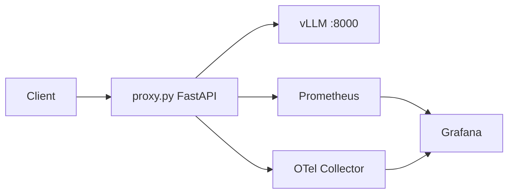
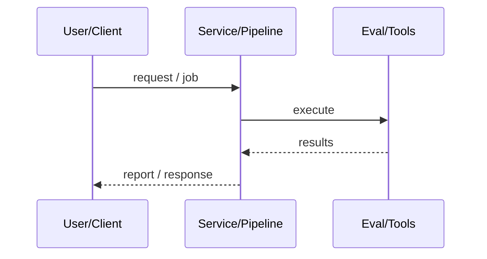
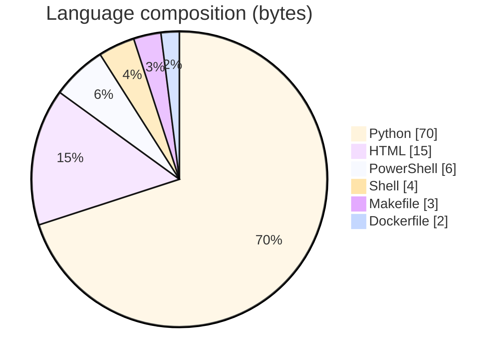

# AI Inference Observability Platform

### Transparent FastAPI proxy that exposes per-request TTFT, TBT, and E2E latency for vLLM without forking the engine.

[](https://github.com/ArchanaChetan07/ai-inference-observability-platform)
[](https://github.com/ArchanaChetan07/ai-inference-observability-platform)
[](https://github.com/ArchanaChetan07/ai-inference-observability-platform)
[](https://github.com/ArchanaChetan07/ai-inference-observability-platform/actions)

---

## Overview

vLLM optimizes GPU throughput but its OpenAI-compatible API does not give clients first-class per-request latency SLIs.

Sidecar/proxy SSE instrumentation, Prometheus metrics, optional OpenTelemetry, Helm/Docker Compose stacks, Grafana dashboards, and measured direct-vs-proxy benchmarks.

On T1000/opt-1.3b at concurrency 5: proxy TTFT P99 891ms vs direct 766ms (−12% RPS, +125ms P99); 51 tests claimed in README; microbench artifacts in benchmarks/results.

This repository is maintained as **production-minded portfolio work**: clear architecture, automated checks where present, and metrics that are **traceable to committed artifacts** (never invented).

---

## Architecture

Clients hit FastAPI proxy which streams to vLLM, annotates latency, exports Prometheus/OTel, and feeds Grafana; Helm deploys the full stack.


```mermaid
flowchart LR
  C[Client] --> PX[proxy.py FastAPI]
  PX --> V[vLLM :8000]
  PX --> PR[Prometheus]
  PX --> OT[OTel Collector]
  PR --> GR[Grafana]
  OT --> GR
```


```mermaid
sequenceDiagram
  participant U as User/Client
  participant S as Service/Pipeline
  participant E as Eval/Tools
  U->>S: request / job
  S->>E: execute
  E-->>S: results
  S-->>U: report / response
```

---

## Results & repository facts

> Only values found in code, configs, tests, or generated reports are listed. Absence of a clinical/ML accuracy number means it was **not** published in-repo.

| Metric | Value | Source |
|---|---|---|
| TTFT P99 @ c=5 via proxy | **891 ms** | `README.md` |
| TTFT P99 @ c=5 direct vLLM | **766 ms** | `README.md` |
| Proxy overhead @ c=5 | **-12% RPS / +125 ms P99** | `README.md` |
| TTFT p50 @ c=1 (proxied bench file) | **172.0 ms** | `benchmarks/results/benchmark_20260709_134247.md` |
| Automated tests (README badge) | **51 passing** | `README.md` |
| sse_role_fast_path ops/sec | **2030.84** | `benchmarks/results/perf_review.json` |
| Tracked files | **124** | `git tree` |
| Python modules | **17** | `git tree` |
| Test-related paths | **7** | `git tree` |
| CI workflows | **Yes** | `.github/workflows` |
| Docker present | **Yes** | `repo root` |


```mermaid
%%{init: {'theme':'base'}}%%
pie showData title Language composition (bytes)
    "Python" : 70
    "HTML" : 15
    "PowerShell" : 6
    "Shell" : 4
    "Makefile" : 3
    "Dockerfile" : 2
```

---

## Key features

- Transparent proxy measuring TTFT/TBT/E2E at HTTP/SSE boundary
- Prometheus scrape endpoints and Grafana dashboard assets
- Optional OTLP export via OpenTelemetry instrumentation
- Helm chart for proxy + vLLM + Prometheus/Grafana/Alertmanager
- k6 smoke and Python benchmark runners with checked-in results
- vllm_patch helpers for deeper engine telemetry experiments

---

## Tech stack

| Layer | Technology |
|---|---|
| Language | Python |
| Framework | FastAPI |
| Framework | OpenTelemetry |
| Tool | Prometheus |
| Tool | Grafana |
| Tool | Helm |
| Tool | Docker |
| API | vLLM OpenAI HTTP |

---

## Skills demonstrated

Python · FastAPI · uvicorn · Prometheus · OpenTelemetry · Helm · Docker Compose · CI/CD · testing · automation

Keyword surface: **Python · Python · machine-learning · CI/CD · testing · API · Docker · automation · data-science · software-engineering · system-design · observability · LLM · cloud**

---

## Project structure

```text
ai-inference-observability-platform/
├── proxy.py vllm_patch/ ui/
├── docker/ helm/ benchmarks/ docs/
├── requirements.txt pyproject.toml LICENSE
└── .github/workflows/
```

---

## Installation & usage

```bash
git clone https://github.com/ArchanaChetan07/ai-inference-observability-platform.git
cd ai-inference-observability-platform
pip install -r requirements.txt
docker compose -f docker/docker-compose.yml up --build
python benchmarks/run_benchmark.py
```

---

## How it works

proxy.py terminates client streaming HTTP, forwards to vLLM, and computes TTFT/TBT/E2E from SSE events without requiring client SDK changes. Metrics expose request latency histograms for Prometheus; optional OTEL_* flags enable OTLP export. Helm charts package proxy, vLLM, and observability sidecars for Kubernetes.

Benchmark scripts compare localhost direct vs proxied ports and check results into benchmarks/results/ with hardware notes (T1000, opt-1.3b).

---

## Future improvements

- Further reduce proxy overhead at higher concurrency
- Deeper first-class engine spans beyond HTTP boundary
- Multi-cluster federation dashboards

---

## License

MIT.

---

<p align="center">
  <b>AI Inference Observability Platform</b><br/>
  <a href="https://github.com/ArchanaChetan07/ai-inference-observability-platform">github.com/ArchanaChetan07/ai-inference-observability-platform</a>
</p>
