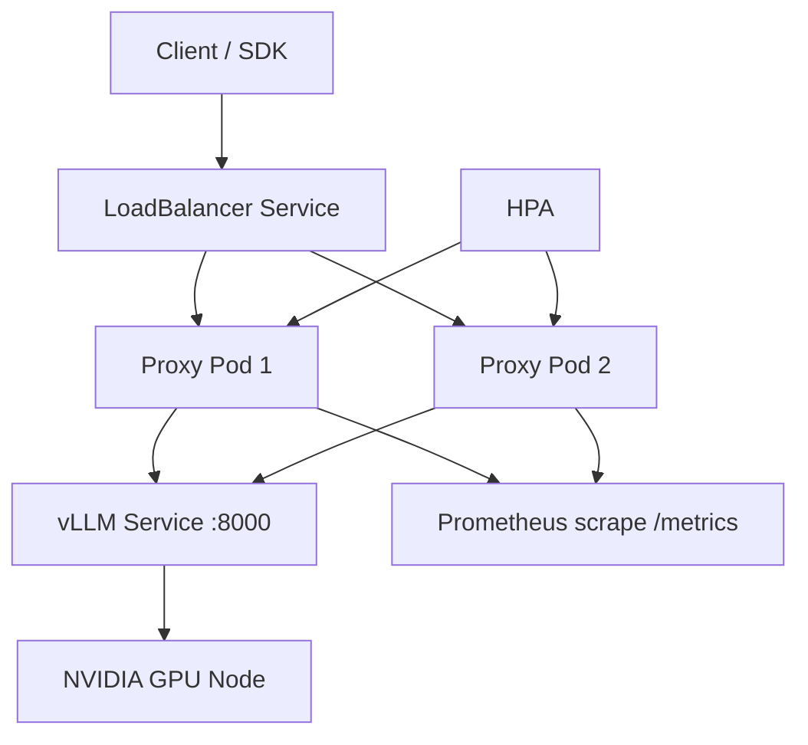

# Kubernetes Deployment Guide

Production manifests live in `k8s/` as modular resources with Kustomize.

## Architecture



| Component | Replicas | GPU | Notes |
|-----------|----------|-----|-------|
| `vllm-latency-proxy` | 2–10 (HPA) | No | Stateless, scales on CPU/memory |
| `vllm` | 1 | 1× NVIDIA | Model weights on PVC |

## Prerequisites

- Kubernetes 1.25+ with NVIDIA GPU Operator or device plugin
- GPU nodes labeled `nvidia.com/gpu.present=true`
- `kubectl` and optional `kustomize`
- HuggingFace token secret

## Deploy

```bash
# 1. Create namespace and HF secret
kubectl create namespace vllm
kubectl create secret generic hf-token \
  --from-literal=HF_TOKEN=hf_YOUR_TOKEN \
  -n vllm

# 2. Build and push proxy image (or use pre-built)
docker build -f docker/Dockerfile -t ghcr.io/ArchanaChetan07/vllm-latency-proxy:1.2.0 .
docker push ghcr.io/ArchanaChetan07/vllm-latency-proxy:1.2.0

# 3. Update proxy image in k8s/proxy-deployment.yaml if needed

# 4. Apply all manifests
kubectl apply -k k8s/

# 5. Wait for rollout
kubectl rollout status deployment/vllm -n vllm
kubectl rollout status deployment/vllm-latency-proxy -n vllm

# 6. Get external endpoint
kubectl get svc vllm-latency-proxy -n vllm
```

## Validate (dry-run)

```bash
kubectl apply -k k8s/ --dry-run=client
kubectl kustomize k8s/ | kubectl apply --dry-run=client -f -
```

## Scaling Behavior

**Proxy HPA** (`k8s/hpa.yaml`):
- Min 2, max 10 replicas
- Targets: CPU 70%, memory 80%
- Scale-up stabilization: 60s; scale-down: 300s

**vLLM** stays at 1 replica by default. Multi-GPU / multi-node vLLM requires tensor-parallel flags — see [multi-node-architecture.md](multi-node-architecture.md).

## Rolling Updates

Both deployments use `RollingUpdate` with `maxUnavailable: 0`, `maxSurge: 1`. Proxy pods drain in-flight streams via readiness probe failure before termination.

## Configuration

Edit `k8s/configmap.yaml` for model, proxy settings, and OpenTelemetry:

```yaml
VLLM_MODEL: "facebook/opt-1.3b"
OTEL_ENABLED: "true"
OTEL_EXPORTER_OTLP_ENDPOINT: "http://otel-collector:4317"
```

## Troubleshooting

See [troubleshooting-k8s.md](troubleshooting-k8s.md).
