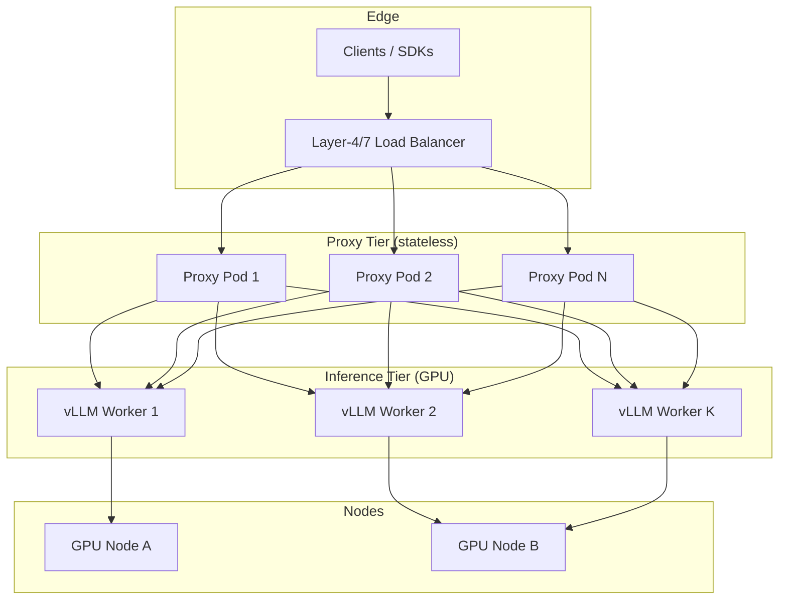

# Multi-Node Inference Architecture

Production LLM serving separates **stateless proxy tier** from **GPU-bound vLLM workers**. This document describes a production-ready design; full multi-GPU tensor parallelism requires a GPU cluster.

## Topology



## Request Routing

1. **Client → LB**: Round-robin or least-connections (nginx, HAProxy, cloud LB).
2. **LB → Proxy**: Any proxy pod; proxy adds `x-request-id`, measures TTFT/TBT.
3. **Proxy → vLLM**: Default: single ClusterIP service. Multi-worker: headless service + consistent hash on `model` or external router (e.g. vLLM router, custom K8s Service per model shard).

## Load Balancing Strategies

| Tier | Strategy | Rationale |
|------|----------|-----------|
| Proxy | Least connections | Long-lived SSE streams |
| vLLM (replicated model) | Round-robin | Each worker holds full model copy |
| vLLM (sharded) | Hash by request/session | KV cache locality |

## Fault Tolerance

- **Proxy**: HPA + PDB (`minAvailable: 1`); pods are stateless.
- **vLLM**: Readiness on `/health`; PDB for planned maintenance; model cache on PVC survives pod restart.
- **LB**: Health checks on `/health` (proxy) not raw vLLM.

## Parallelism Modes

### Tensor Parallelism (TP)

Single model split across N GPUs on one or more nodes:

```bash
python -m vllm.entrypoints.openai.api_server \
  --model meta-llama/Llama-3-70B \
  --tensor-parallel-size 4
```

Requires high-bandwidth interconnect (NVLink / InfiniBand).

### Pipeline Parallelism (PP)

Layers split across stages; higher latency per token, fits very large models.

### Data Parallelism (replicated workers)

Multiple independent vLLM instances, each with full model — simplest for multi-node when model fits on one GPU.

## KV Cache Considerations

- **Replicated workers**: No shared KV cache; each request is independent. Good for stateless APIs.
- **Prefix caching** (vLLM feature): Benefits repeated system prompts; requires sticky routing or shared cache layer for optimal hit rate.
- **Disaggregated prefill/decode**: Advanced — separate prefill and decode pools (future vLLM architectures).

## Autoscaling

| Component | Metric | Notes |
|-----------|--------|-------|
| Proxy | CPU, memory, custom `vllm_proxy_active_requests` | Fast scale (seconds) |
| vLLM | GPU util, queue depth, TTFT SLO | Slow scale (minutes); model load time |

**Do not HPA vLLM on CPU alone** — GPU saturation is the signal. Use KEDA with Prometheus custom metrics or manual replica count per model.

## Scheduling

```yaml
nodeSelector:
  nvidia.com/gpu.present: "true"
tolerations:
  - key: nvidia.com/gpu
    operator: Exists
    effect: NoSchedule
affinity:
  podAntiAffinity:
    preferredDuringSchedulingIgnoredDuringExecution:
      - weight: 100
        podAffinityTerm:
          labelSelector:
            matchLabels:
              app.kubernetes.io/component: vllm
          topologyKey: kubernetes.io/hostname
```

## Local Simulation

Simulate proxy-tier load balancing (single vLLM, two proxies):

```bash
docker compose -f docker/docker-compose.yml up -d vllm
docker compose -f docker/docker-compose.multi.yml up -d --build
curl http://localhost:8888/health
```

Traffic hits nginx → `proxy-1` / `proxy-2` → shared `vllm`.

## Production Checklist

- [ ] Separate namespaces for inference vs observability
- [ ] NetworkPolicy: proxy → vLLM only on port 8000
- [ ] Secrets for HF token via external secrets operator
- [ ] Pod anti-affinity for proxy and vLLM
- [ ] Monitoring: Prometheus + traces (OTel) + logs
- [ ] Runbooks for model reload and GPU node drain
