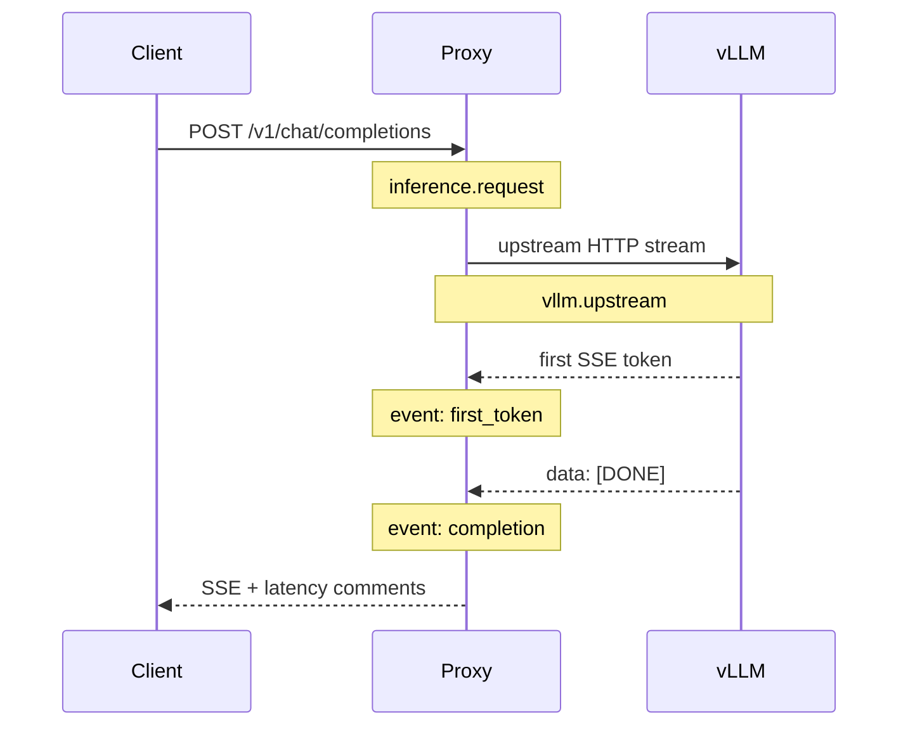

# OpenTelemetry Architecture

Distributed tracing complements Prometheus metrics by recording **per-request latency breakdowns** with trace and span IDs.

## Span Hierarchy



| Span | Attributes |
|------|------------|
| `inference.request` | `request.id`, `llm.model`, `llm.streaming` |
| `vllm.upstream` | `request.id`, `http.route` |
| Events | `first_token` (ttft_ms), `completion` (full breakdown) |

Response headers when enabled: `x-trace-id`, `x-span-id`.

## Metrics vs Traces

| Prometheus | OpenTelemetry |
|------------|---------------|
| Aggregated histograms (P50/P99 across all requests) | Single-request waterfall |
| Always-on, low cardinality | Rich context, higher storage |
| Alerting & dashboards | Root-cause debugging |
| `/metrics` scrape | OTLP push |

Use **both**: Prometheus for SLOs and alerts; traces for investigating latency spikes on specific requests.

## Enable Locally

```bash
docker compose -f docker/docker-compose.yml -f docker/docker-compose.otel.yml up -d --build
```

Open Jaeger UI: http://localhost:16686

Send a streaming request:

```bash
curl -N http://localhost:8080/v1/chat/completions \
  -H "Content-Type: application/json" \
  -d '{"model":"facebook/opt-1.3b","messages":[{"role":"user","content":"Hello"}],"stream":true,"max_tokens":32}'
```

Look for service `vllm-latency-proxy` with spans `inference.request` → `vllm.upstream`.

## Export Backends

| Backend | Collector exporter |
|---------|-------------------|
| Jaeger | `otlp/jaeger` → `jaeger:4317` |
| Grafana Tempo | `otlp/tempo` → `tempo:4317` |
| Any OTLP | `otlp` with endpoint from env |

Environment variables:

```bash
OTEL_ENABLED=true
OTEL_SERVICE_NAME=vllm-latency-proxy
OTEL_EXPORTER_OTLP_ENDPOINT=http://otel-collector:4317
OTEL_EXPORTER_OTLP_PROTOCOL=grpc   # or http/protobuf
```

## Kubernetes / Helm

```bash
helm install latency-metrics ./helm \
  --set opentelemetry.enabled=true \
  --set opentelemetry.collector.enabled=true
```

## Example Trace Attributes

```json
{
  "name": "inference.request",
  "attributes": {
    "request.id": "req-a1b2c3",
    "llm.model": "facebook/opt-1.3b",
    "llm.streaming": true,
    "latency.ttft_ms": 142.5,
    "latency.mean_tbt_ms": 18.3,
    "latency.e2e_ms": 890.1,
    "latency.total_tokens": 32
  }
}
```
