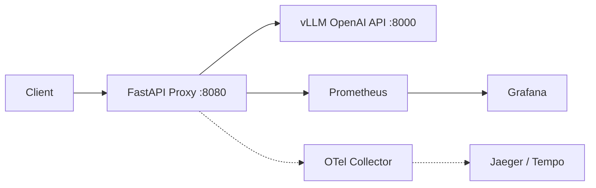

# Repository Analysis — AI Inference Observability Platform

**Generated:** 2026-06-29  
**Version:** 1.2.0  
**Repository:** [ArchanaChetan07/ai-inference-observability-platform](https://github.com/ArchanaChetan07/ai-inference-observability-platform)

---

## Executive Summary

This repository implements a **transparent FastAPI proxy** in front of [vLLM](https://github.com/vllm-project/vllm) that measures **Time-To-First-Token (TTFT)**, **Time-Between-Tokens (TBT)**, and **end-to-end latency**, exposing them via HTTP headers, OpenAI-compatible `usage` fields, SSE comment frames, Prometheus metrics, and optional OpenTelemetry traces.

The platform targets **MLOps / AI infrastructure** portfolios with Docker Compose (local GPU), Kubernetes manifests, Helm charts, and a GitHub Actions CI/CD pipeline.

---

## Architecture



### Request path

1. Client sends `POST /v1/chat/completions` (streaming or non-streaming) to the proxy.
2. Proxy forwards to `VLLM_BASE_URL` via `httpx` async client.
3. `StreamLatencyTracker` (`vllm_patch/latency_utils.py`) measures TTFT/TBT on SSE chunks.
4. Metrics recorded to Prometheus histograms; optional OTLP spans via `vllm_patch/telemetry.py`.
5. Response enriched with `X-TTFT-Ms`, `X-TBT-Ms`, `X-E2E-Ms` headers and extended `usage`.

---

## Module Dependency Graph

```
proxy.py
├── vllm_patch/latency_utils.py   (TTFT/TBT tracking, percentiles)
├── vllm_patch/telemetry.py       (OpenTelemetry optional)
├── vllm_patch/outputs.py         (response enrichment)
├── fastapi / uvicorn / httpx
└── prometheus_client

benchmarks/run_benchmark.py
└── httpx (load generator)

tests/
├── test_latency_metrics.py
├── test_latency_utils.py
├── test_concurrent.py
├── test_edge_cases.py
└── test_telemetry.py
```

---

## Deployment Topology

| Layer | Components | Purpose |
|-------|-----------|---------|
| **Application** | `proxy.py`, `vllm_patch/` | Latency instrumentation |
| **Inference** | vLLM container (GPU) | Model serving |
| **Compose** | `docker/docker-compose.yml` | Local dev + GPU stack |
| **Kubernetes** | `k8s/` (Kustomize) | Production manifests |
| **Helm** | `helm/` | Parameterized releases |
| **Monitoring** | Prometheus, Grafana, `monitoring/` | Metrics & dashboards |
| **CI/CD** | `.github/workflows/main.yml` | Lint, test, build, release |

### Hybrid Docker Desktop pattern

On Windows/macOS without K8s GPU:

- vLLM runs in **Docker Compose** (host GPU via NVIDIA runtime).
- Proxy + monitoring run in **Kubernetes** (`helm/values-docker-desktop.yaml`).
- Proxy uses `VLLM_BASE_URL=http://host.docker.internal:8000`.

---

## Network Architecture

| Service | Port | Protocol |
|---------|------|----------|
| Proxy | 8080 (host 8082 default) | HTTP |
| vLLM | 8000 | HTTP OpenAI API |
| Prometheus | 9090 | HTTP |
| Grafana | 3000 | HTTP |
| OTel Collector | 4317/4318 | gRPC/HTTP |

**NetworkPolicies** (`k8s/networkpolicy.yaml`, `helm/templates/networkpolicy.yaml`):

- Proxy ingress on 8080; egress to vLLM:8000, DNS, OTLP.
- vLLM ingress from proxy only; egress for model downloads (80/443).

---

## Storage Architecture

| Resource | Type | Usage |
|----------|------|-------|
| `hf-cache` PVC | ReadWriteOnce | HuggingFace model weights |
| Container filesystem | ephemeral | Proxy (read-only root) |
| Prometheus TSDB | emptyDir / PVC | Metrics retention |
| Grafana | emptyDir | Dashboard state |

---

## Observability Architecture

### Metrics (Prometheus)

- `vllm_proxy_ttft_milliseconds` — histogram
- `vllm_proxy_tbt_milliseconds` — histogram
- `vllm_proxy_requests_total` — counter by endpoint/status
- `vllm_proxy_active_requests` — gauge
- `vllm_proxy_e2e_milliseconds` — histogram

### Dashboards & alerts

- `monitoring/grafana/dashboards/vllm-latency.json`
- `monitoring/alerts.yml` — TTFT p95, error rate rules

### Tracing (optional)

- Enable via `OTEL_ENABLED=true`
- Exporter: OTLP gRPC to collector
- Auto-instrumentation: FastAPI, httpx

### Logging

- Structured uvicorn access logs
- `LOG_LEVEL` env configurable (DEBUG in dev overlay)

---

## CI/CD Architecture

`.github/workflows/main.yml`:

| Job | Actions |
|-----|---------|
| lint | ruff, mypy |
| test | pytest matrix 3.10–3.12, coverage |
| security | bandit, pip-audit, trivy fs scan |
| docker | buildx, GHCR push, SBOM |
| helm | lint, template, kubectl dry-run |
| release | helm package, GitHub release on tags |

---

## Security Architecture

- **Container:** non-root user (UID 1000), read-only root filesystem, multi-stage build
- **Kubernetes:** ServiceAccount (no token auto-mount), seccomp RuntimeDefault, resource limits
- **Secrets:** HF token via K8s Secret reference (not in ConfigMap)
- **Network:** NetworkPolicy least-privilege egress
- **Supply chain:** SBOM generation in CI (anchore/sbom-action)

---

## File Inventory (key paths)

```
proxy.py                    # Main FastAPI application
vllm_patch/                 # Latency + telemetry modules
docker/Dockerfile           # Multi-stage production image
docker/docker-compose.yml   # Full local stack
k8s/                        # Kustomize manifests
helm/                       # Helm chart (primary)
monitoring/                 # Prometheus, Grafana, alerts
tests/                      # 48+ unit/integration tests
benchmarks/                 # Load benchmark harness
.github/workflows/main.yml  # CI/CD pipeline
docs/                       # Deployment & ops guides
reports/                    # Analysis artifacts (this file)
```

---

## Test Coverage

| Category | Count | Marker |
|----------|-------|--------|
| Unit | ~35 | `unit` |
| Integration | ~10 | `integration` |
| Regression | included | `regression` |
| E2E | 5 | `e2e` (requires live vLLM) |
| Benchmark | — | `benchmark` |

**Last run:** 48 passed, 5 deselected (e2e) — 2026-06-29
